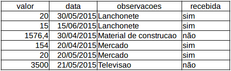
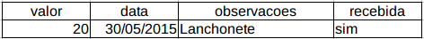

# Meu problema

Chegou o fim do mês e não sei direito onde meu dinheiro foi parar, no meu bolso não está. Nem na conta bancária. É um problema comum, e como podemos fazer para controlar os gastos?

A maneira mais simples de entender onde o dinheiro está indo é anotar todos os nossos gastos, sendo uma das mais tradicionais e antigas escrevê-los em um caderninho. Por exemplo dia 05/01/2016 gastei R$ 20 em uma Lanchonete, escrevo isso bonitinho em uma linha.

```
R$20 05/01/2016 Lanchonete
```

Tive um outro gasto de lanchonete no dia 06/01/2016 no valor de R$ 15, vou e anoto novamente:

```
R$20 05/01/2016 Lanchonete
R$15 06/01/2016 Lanchonete
```

Por fim, minha esposa comprou um guarda-roupa pro quarto e ele ainda não chegou, então anotei:

```
R$20 05/01/2016 Lanchonete
R$15 06/01/2016 Lanchonete
R$915,5 06/01/2016 Guarda-roupa (não recebi)
```

Repara que do jeito que anotei, as linhas acabam se assemelhando a uma tabelinha:

```
+---------+------------+--------------+--------------+
+ R$20    + 05/01/2016 + Lanchonete   + recebida     +
+ R$15    + 06/01/2016 + Lanchonete   + recebida     +
+ R$915,5 + 06/01/2016 + Guarda-roupa + não recebida +
+---------+------------+--------------+--------------+
```

Mas o que significa a primeira coluna dessa tabela mesmo? O valor gasto? Ok. E a segunda? É a data da compra? E a terceira, é o lugar que comprei ou são anotações relativas aos gastos? Repara que sem dar nome as colunas, minhas compras ficam confusas, a tabela fica estranha, e posso cada vez preencher com algo que *acho* que devo, ao invés de ter certeza do que cada campo significa. Como identificar cada um deles? Vamos dar um nome aos três campos que compõem a minha tabela: o valor, a data e as observações:

```
+---------+------------+--------------+--------------+
+ valor   + data       + observacoes  + recebida     +
+---------+------------+--------------+--------------+
+ R$20    + 05/01/2016 + Lanchonete   + recebida     +
+ R$15    + 06/01/2016 + Lanchonete   + recebida     +
+ R$915,5 + 06/01/2016 + Guarda-roupa + não recebida +
+---------+------------+--------------+--------------+
```

Posso também simplificar os dados da coluna *recebida* somente indicando se ela foi recebida (sim) ou não (não):

```
+---------+------------+--------------+--------------+
+ valor   + data       + observacoes  + recebida     +
+---------+------------+--------------+--------------+
+ R$20    + 05/01/2016 + Lanchonete   + sim          +
+ R$15    + 06/01/2016 + Lanchonete   + sim          +
+ R$915,5 + 06/01/2016 + Guarda-roupa + não          +
+---------+------------+--------------+--------------+
```

Para montar essa tabela em um caderno eu tenho que ser capaz de traçar linhas bonitinhas e eu, pessoalmente, sou horrível para isso. No mundo tecnológico de hoje em dia, anotaríamos essa tabela em uma planilha eletrônica como o Excel:



# Um banco para os dados

Porém, além de guardar as informações, eu quero manter um histórico, tirar média semestral ou mensal, saber quanto que eu gastei com lanchonete ou mercado durante um período e realizar tarefas futuras como relatórios complexos. O Excel é uma ferramenta bem poderosa e flexível, porém, dependendo da quantidade de registros, a manipulação dos dados começa a ficar um pouco complicada em uma planilha eletrônica. 

Para facilitar o nosso trabalho, existem softwares para armazenar, guardar os dados. Esses bancos de dados são sistemas que gerenciam desde a forma de armazenar a informação como também como consultá-la de maneira eficiente.

Os chamados Sistema de Gerenciamento de Banco de Dados (SGBD), nos permitem realizar todas essas tarefas sem nos preocuparmos com o caderninho ou a caneta. Claro que se vamos nos comunicar com alguém que vai gerenciar nossos dados precisamos falar uma língua comum, conversar em uma linguagem padrão que vários bancos utilizem. 

Um padrão que surgiu para acessarmos e pesquisarmos dados armazenados e estruturados de uma forma específica é uma linguagem de consultas estruturadas, Structured Query Language, ou simplesmente SQL. Para conseguirmos utilizar essa linguagem, precisamos instalar um SGBD que será o nosso servidor de banco de dados, como por exemplo o MySQL, Oracle ou SQLServer.

Neste curso utilizaremos o MySQL, um SGBD gratuito que pode ser instalado seguindo as maneiras tradicionais de cada sistema operacional. Por exemplo, no Windows, o processo é realizado através do download de um arquivo .msi, enquanto no Linux (versões baseadas em Debian), pode ser feito através de um simples comando apt-get, e no MacOS pode ser instalado com um pacote .dmg. Baixe o seu instalador em http://dev.mysql.com/downloads/mysql/

## Criando o nosso banco de dados

Durante todo o curso usaremos o terminal do MySQL. Existe também a interface gráfica do Workbench do MySQL, que não utilizaremos. Ao utilizarmos o terminal não nos preocupamos com o aprendizado de mais uma ferramenta que é opcional, podendo nos concentrar no SQL, que é o objetivo deste curso.

Abra o terminal do seu sistema operacional. No Windows, digite `cmd` no Executar. No Mac e Linux, abra o terminal. Nele, vamos entrar no MySQL usando o usuário *root*:

```
mysql -uroot -p
```

O `-u` indica o usuário `root`, e o `-p` é porque digitaremos a senha. Use a senha que definiu durante a instalação do MySQL, note que por padrão a senha pode ser em branco e, nesse caso, basta pressionar enter.

## Começando um caderno novo: criando o banco

Agora que estamos conectados ao MySQL precisamos dizer a ele que queremos um caderno novo. Começaremos com um que gerenciará todos os dados relativos aos nossos gastos, permitindo que controlemos melhor nossos gastos, portanto quero um banco de dados chamado *ControleDeGastos*, pode parecer estranho, mas não existe um padrão para nomear um banco de dados, por isso utilizamos o padrão *CamelCase*. Para criar um banco de dados basta mandar o MySQL criar um banco:

```
mysql> CREATE DATABASE
```

Mas qual o nome mesmo? *ControleDeGastos*? Então:

```
mysql> CREATE DATABASE ControleDeGastos
```

Dou enter e o MySQL fica esperando mais informações:

```
mysql> CREATE DATABASE ControleDeGastos
    -> 
```

Acontece que em geral precisamos notificar o MySQL que o comando que desejamos já foi digitado por completo. Para fazer isso usamos o caractere ponto e vírgula (*;*):

```
mysql> CREATE DATABASE ControleDeGastos
    -> ;
    Query OK, 1 row affected (0.01 sec)
```

Agora sim, ele percebeu que acabamos nosso comando (que começou na primeira linha) e indicou que o pedido (a query) foi executada com sucesso (*OK*), demorou 0.01 segundo e gerou 1 resultado (*1 row affected*).

Da mesma maneira que criamos esse banco, não é uma regra, mas é comum ter um banco de dados para cada projeto. Por exemplo:

```
mysql> CREATE DATABASE caelum
    -> ;
    Query OK, 1 row affected (0.01 sec)

mysql> CREATE DATABASE alura
    -> ;
    Query OK, 1 row affected (0.01 sec)

mysql> CREATE DATABASE casadocodigo
    -> ;
    Query OK, 1 row affected (0.01 sec)
```

Agora que tenho diversos bancos, como posso dizer ao MySQL que queremos usar aquele primeiro de todos? Quero dizer para ele, por favor, *use* o banco chamado *ControleDeGastos*. Usar em inglês, é *USE*, portanto:

```
mysql> USE ControleDeGastos;
Database changed
```

## O padrão utilizado neste curso

Repare que as palavras que são de minha autoria, minha escolha, deixamos em minúsculo, enquanto as palavras que são específicas da linguagem SQL deixamos em maiúsculo. Esse é um padrão como existem diversos outros padrões. Adotamos este para que a qualquer momento que você veja um comando SQL neste curso, identifique o que é palavra importante (palavra chave) do SQL e o que é o nome de um banco de dados, uma tabela, uma coluna ou qualquer outro tipo de palavra que é uma escolha livre minha, como usuário do banco.

## A tabela de compras

Agora que já tenho um caderno, já estou louco para escrever o meu primeiro gasto, que foi numa lanchonete. Por exemplo, peguei uma parte do meu caderno, de verdade, de 2016:

```
+---------+------------+--------------+--------------+
+ valor   + data       + observacoes  + recebida     +
+---------+------------+--------------+--------------+
+ R$20    + 05/01/2016 + Lanchonete   + sim          +
+ R$15    + 06/01/2016 + Lanchonete   + sim          +
+ R$915,5 + 06/01/2016 + Guarda-roupa + não          +
+     ... +        ... + ...          + ...          +
+---------+------------+--------------+--------------+
```

Ok. Quero colocar a minha primeira anotação no banco. Mas se o banco é o caderno... como que o banco sabe que existe uma tabela de valor, data e observações? Aliás, até mesmo quando comecei com o meu caderno, fui eu, Guilherme, que tive que desenhar a tabela com suas três coluninhas em cada uma das páginas que eu quis colocar seus dados.

Então vamos fazer a mesma coisa com o banco. Vamos dizer a ele que queremos ter uma tabela: descrevemos a estrutura dela através de um comando SQL. Nesse comando devemos dizer quais são os campos (valor, data e observações) que serão utilizados, para que ele separe o espaço específico para cada um deles toda vez que inserimos uma nova compra, toda vez que registramos um novo dado (um registro novo).

Para criar uma tabela, novamente falamos inglês, por favor senhor MySQL, crie uma tabela (`CREATE TABLE`) chamada *compras*:

```
mysql> CREATE TABLE compras;
ERROR 1113 (42000): A table must have at least 1 column
```

Como assim erro 1113? Logo após o código do erro, o banco nos informou que toda tabela deve conter pelo menos uma coluna. Verdade, não falei as colunas que queria criar. Vamos olhar novamente nossas informações:

```
+---------+------------+--------------+--------------+
+ valor   + data       + observacoes  + recebida     +
+---------+------------+--------------+--------------+
+ R$20    + 05/01/2016 + Lanchonete   + sim          +
+ R$15    + 06/01/2016 + Lanchonete   + sim          +
+ R$915,5 + 06/01/2016 + Guarda-roupa + não          +
+     ... +        ... + ...          + ...          +
+---------+------------+--------------+--------------+
```

A estrutura da tabela é bem clara: são 4 campos distintos, valor que é um número com ponto decimal, data é uma data, observações que é um texto livre e recebida que é ou sim ou não.

Portanto vamos dizer ao banco que queremos esses 4 campos na nossa tabela, com uma única ressalva, que para evitar problemas de encoding usamos sempre nomes que usam caracteres simples, nada de acento para os nomes de nossas tabelas e colunas:

```
mysql> CREATE TABLE compras(
valor,
data,
observacoes,
recebida);
ERROR 1064 (42000): You have an error in your SQL syntax; check the manual that corresponds to your MySQL server version for the right syntax to use near '
data,
observacoes,
recebida)' at line 2
```

Ainda não foi dessa vez. Repara que o erro 1064 indica um erro de sintaxe no comando *CREATE TABLE*. Na verdade o banco de dados está interessado em saber qual o tipo de cada campo e justamente por isso devemos explicar campo a campo qual o tipo de cada coluna nossa. A coluna, campo, *valor* recebe um valor com possíveis casas decimais. Para isso podemos usar um tipo que representa números decimais. No nosso caso suportando até 18 casas antes da vírgula e 2 depois dela:

```
valor DECIMAL(18,2),
```

Já o campo data é do tipo de data:

```
data DATE,
```

A coluna observações é um texto livre, que costuma ser chamado por um conjunto variável de caracteres, por isso *VARCHAR*. Assim como no caso do número decimal, devemos falar o tamanho máximo dessa coluna. No nosso caso serão até 255 caracteres:

```
observacoes VARCHAR(255),
```

Por fim chegamos a coluna *recebida*, que deve ser representada com valores do tipo *verdadeiro* ou *falso*, algo como *sim* ou *não*. No padrão de banco relacionais não existe um campo que aceite os valores *verdadeiro* e *falso*, um campo *booleano*. O que fazemos então é utilizar um campo numérico com os valores *0* para representar o negativo e *1* para o caso positivo. Uma coluna com um numerozinho, um *TINYINT*:

```
recebida TINYINT
```

Se vamos utilizar *0* e *1* para o *recebida*, nossos dados ficariam agora:

```
+---------+------------+--------------+----------+
+ valor   + data       + observacoes  + recebida +
+---------+------------+--------------+----------+
+ R$20    + 05/01/2016 + Lanchonete   + 1        +
+ R$15    + 06/01/2016 + Lanchonete   + 1        +
+ R$915,5 + 06/01/2016 + Guarda-roupa + 0        +
+     ... +        ... + ...          + ...      +
+---------+------------+--------------+----------+
```

Agora que já sabemos como declarar cada campo, vamos a nova tentativa de criar nossa tabela:

```
mysql> CREATE TABLE compras(
valor DECIMAL(18,2), 
data DATE, 
observacoes VARCHAR(255), 
recebida TINYINT);
Query OK, 0 rows affected (0.04 sec)
```

A tabela *compras* foi criada com sucesso.

## Conferindo a existência de uma tabela

Mas você confia em tudo que todo mundo fala? Vamos ver se realmente a tabela foi criada em nosso banco de dados. Se você possuisse um caderninho de tabelas, o que eu poderia fazer para pedir para me mostrar sua tabela de compras? Por favor, me descreve sua tabela de compras?

```
mysql> desc compras;
+-------------+---------------+------+-----+---------+-------+
| Field       | Type          | Null | Key | Default | Extra |
+-------------+---------------+------+-----+---------+-------+
| valor       | decimal(18,2) | YES  |     | NULL    |       |
| data        | date          | YES  |     | NULL    |       |
| observacoes | varchar(255)  | YES  |     | NULL    |       |
| recebida    | tinyint(4)    | YES  |     | NULL    |       |
+-------------+---------------+------+-----+---------+-------+
4 rows in set (0.01 sec)
```

E aí está nossa tabela de compras. Ela possui 4 colunas, que são chamados de *campos* (*fields*). Cada campo é de um tipo diferente (*decimal*, *date*, *varchar* e *tinyint*) e possui até mesmo informações extras que utilizaremos no decorrer do curso!

## Inserindo registros no banco de dados

Chegou a hora de usar nossa tabela: queremos inserir dados, então começamos pedindo para inserir algo em *compras*:

```
INSERT INTO compras
```

Não vamos cometer o mesmo erro da última vez. Se desejamos fazer algo com os 4 campos da tabela, temos que falar os valores que desejamos adicionar. Por exemplo, vamos pegar as informações da primeira linha da planilha:



Então nós temos uma compra com valor *20*, observação *Lanchonete*, data *05/01/2016*, e que foi recebida com sucesso (*1*):

```
mysql> INSERT INTO compras VALUES (20, 'Lanchonete', '05/01/2016', 1);
ERROR 1292 (22007): Incorrect date value: 'Lanchonete' for column 'data' at row 1
```

Parece que nosso sistema pirou. Ele achou que a *Lanchonete* era a data. *Lanchonete* era o campo *observacoes*. Mas... como ele poderia saber isso? Eu não mencionei para ele a ordem dos dados, então ele assumiu uma ordem determinada, uma ordem que eu não prestei atenção, mas foi fornecida quando executamos o `DESC compras`:

```
| valor       | decimal(18,2) | YES  |     | NULL    |       |
| data        | date          | YES  |     | NULL    |       |
| observacoes | varchar(255)  | YES  |     | NULL    |       |
| recebida    | tinyint(4)    | YES  |     | NULL    |       |
```

Tentamos novamente, agora na ordem correta dos campos:

```
mysql> INSERT INTO compras VALUES (20, '05/01/2016', 'Lanchonete', 1);
ERROR 1292 (22007): Incorrect date value: '05/01/2016' for column 'data' at row 1
```

Outro erro? Agora ele está dizendo que o valor para data está incorreto, porém, aqui no Brasil, usamos esse formato para datas... O que faremos agora? Que tal tentarmos utilizar o formato que já vem por padrão no MySQL que é `ano-mês-dia`? 

Vamos tentar mais uma vez, porém, dessa vez, com a data '2016-01-05':


```
mysql> INSERT INTO compras VALUES (20, '2016-01-05', 'Lanchonete', 1);
Query OK, 1 row affected (0.01 sec)
```

Agora sim os dados foram inseridos com sucesso. Temos um novo registro em nossa tabela. Mas porque será que o MySQL adotou o formato `ano-mês-dia` ao invés de `dia/mês/ano`? O formato `ano-mês-dia` é utilizado pelo padrão SQL, ou seja, por questões de padronização, ele é o formato mais adequado para que funcione para todos.

## Selecão simples

Como fazemos para conferir se ele foi inserido? Pedimos para o sistema de banco de dados selecionar todos os campos (asterisco) da nossa tabela de compras. Queremos fazer uma consulta (uma *query*) de seleção (*SELECT*) na (*FROM*) tabela *compras*:

```
mysql> SELECT * FROM compras;
+-------+------------+-------------+----------+
| valor | data       | observacoes | recebida |
+-------+------------+-------------+----------+
| 20.00 | 2016-01-05 | Lanchonete  |        1 |
+-------+------------+-------------+----------+
1 row in set (0.00 sec)
```

Perfeito! Registro inserido e selecionado com sucesso. Hora de revisar um errinho que deixamos para trás.

## A formatação de números decimais

Desejamos inserir os dois próximos registros de nossa tabela:

```
+---------+------------+--------------+----------+
+ valor   + data       + observacoes  + recebida +
+---------+------------+--------------+----------+
+ R$20    + 05/01/2016 + Lanchonete   + 1        +
+ R$15    + 06/01/2016 + Lanchonete   + 1        +
+ R$915,5 + 06/01/2016 + Guarda-roupa + 0        +
+     ... +        ... + ...          + ...      +
+---------+------------+--------------+----------+
```

Portanto o primeiro `INSERT`:

```
mysql> INSERT INTO compras VALUES (15, '2016-01-06', 'Lanchonete', 1);
Query OK, 1 row affected (0.01 sec)
```

E a segunda linha:

```
mysql> INSERT INTO compras VALUES (915,5, '2016-01-06', 'Guarda-roupa', 0);
ERROR 1136 (21S01): Column count doesn't match value count at row 1
```

O erro indica que o número de colunas não condiz com o número de colunas que temos na tabela. Vamos dar uma olhada dentro de *VALUES*?

```
(915,5, '2016-01-06', 'Guarda-roupa', 0)
```

A vírgula apareceu 4 vezes, portanto teríamos 5 campos diferentes! Repare que o valor `915,5` está formatado no estilo português do Brasil, diferente do estilo inglês americano, que usa ponto para definir o valor decimal, como em `915.5`. Alteramos e executamos:

```
mysql> INSERT INTO compras VALUES (915.5, '2016-01-06', 'Guarda-roupa', 0);
Query OK, 1 row affected (0.00 sec)
```

Podemos conferir os 3 registros que inserimos através do `SELECT` que fizemos antes:

```
mysql> SELECT * FROM compras;
+--------+------------+--------------+----------+
| valor  | data       | observacoes  | recebida |
+--------+------------+--------------+----------+
|  20.00 | 2016-01-05 | Lanchonete   |        1 |
|  15.00 | 2016-01-06 | Lanchonete   |        1 |
| 915.50 | 2016-01-06 | Guarda-roupa |        0 |
+--------+------------+--------------+----------+
3 rows in set (0.01 sec)
```

Mas e se eu quisesse inserir os dados em uma ordem diferente? Por exemplo, primeiro informar a `data`, depois as `observacoes`, `valor`, e por fim se foi `recebida` ou não? Será que podemos fazer isso? Quando estamos fazendo um `INSERT`, podemos informar o que estamos querendo inserir por meio de parênteses:

```
mysql> INSERT INTO compras (data, observacoes, valor, recebida)
```

Note que agora estamos informando **explicitamente** a ordem dos valores que informaremos após a instrução `VALUES`:

```
mysql> INSERT INTO compras (data, observacoes, valor, recebida)
VALUES ('2016-01-10', 'Smartphone', 949.99, 0);
Query OK, 1 row affected (0,00 sec)
```

Se consultarmos a nossa tabela:

```
mysql> SELECT * FROM compras;
+--------+------------+--------------+----------+
| valor  | data       | observacoes  | recebida |
+--------+------------+--------------+----------+
|  20.00 | 2016-01-05 | Lanchonete   |        1 |
|  15.00 | 2016-01-06 | Lanchonete   |        1 |
| 915.50 | 2016-01-06 | Guarda-roupa |        0 |
| 949.99 | 2016-01-10 | Smartphone   |        0 |
+--------+------------+--------------+----------+
4 rows in set (0,00 sec)
```

A nossa compra foi inserida corretamente, porém com uma ordem diferente da estrutura da tabela.

## A chave primária

Agora se eu olhar essa minha tabela depois de 6 meses e encontrar essas linhas, como vou falar sobre uma das minhas compras? Tenho que falar "lembra da compra na lanchonete feita no dia 2016-01-05 no valor de 20.00 que já foi recebida?". Fica difícil referenciar cada linha da tabela por todos os valores dela. Seria muito mais fácil se eu pudesse falar: "sabe a compra 15?" ou "sabe a compra 37654?".

Fica difícil falar sobre um registro se eu não tenho nada identificando ele de maneira única. Por exemplo, como você sabe que eu sou o Guilherme, e não o Paulo? Pois meu CPF é um identificador único, (por exemplo) 222.222.222-22. Só eu tenho esse CPF e ele me identifica. O Paulo tem o dele, 333.333.333-33.

O mesmo vale para computadores de uma marca, por exemplo, o meu tem número de série 16X000015, e o computador que está ao lado do meu tem o número de série 16X000016. A única maneira de identificar unicamente uma coisa é tendo uma chave importantíssima, uma chave que é tão importante, que é primária aos brasileiros, aos computadores... e as minhas compras.

Mas como definir esses números únicos? Devo usar o ano de fabricação como no caso do computador que começa com 16 (ano 2016)? Ou sequencias com números diferentes como no caso do CPF?

Existem diversas maneiras de gerar esses números únicos, mas a mais simples de todas é: começa com 1. A primeira compra é a compra 1. A segunda compra é a 2. A terceira é a 3. Uma sequencia natural, que é incrementada automaticamente a cada nova compra, a cada novo registro.

É isso que queremos, um campo que seja nossa chave primária (`PRIMARY KEY`), que é um número inteiro (`INT`), e que seja automaticamente incrementado (`AUTO_INCREMENT`). Só falta definir o nome dele, que como identifica nossa compra, usamos a abreviação `id`. Esse é um padrão *amplamente* utilizado. Portanto queremos um campo `id INT AUTO_INCREMENT PRIMARY KEY`.

Para fazer isso vamos alterar nossa tabela (`ALTER_TABLE`) e adicionar uma coluna nova (`ADD_COLUMN`):

```
mysql> ALTER TABLE compras ADD COLUMN id INT AUTO_INCREMENT PRIMARY KEY;
Query OK, 0 rows affected (0.07 sec)
Records: 0  Duplicates: 0  Warnings: 0
```

E verificamos o resultado em nossa tabela:

```
mysql> SELECT * FROM compras;
+--------+------------+--------------+----------+----+
| valor  | data       | observacoes  | recebida | id |
+--------+------------+--------------+----------+----+
|  20.00 | 2016-01-05 | Lanchonete   |        1 |  1 |
|  15.00 | 2016-01-06 | Lanchonete   |        1 |  2 |
| 915.50 | 2016-01-06 | Guarda-roupa |        0 |  3 |
| 949.99 | 2016-01-10 | Smartphone   |        0 |  4 |
+--------+------------+--------------+----------+----+
4 rows in set (0,00 sec)
```

Repare que agora todas as compras podem ser identificadas unicamente!

## Recriando a tabela do zero

Claro que o padrão não é criar o `id` depois de um ano. Em geral criamos uma tabela já com o seu campo `id`. Vamos então adaptar nossa query para criar a tabela com todos os campos, inclusive o campo `id`:

```
CREATE TABLE compras(
id INT AUTO_INCREMENT PRIMARY KEY, 
valor DECIMAL(18,2), 
data DATE, 
observacoes VARCHAR(255), 
recebida TINYINT);

ERROR 1050 (42S01): Table 'compras' already exists
```

Opa, como a tabela já existe não faz sentido recriá-la. Primeiro vamos jogar ela fora (`DROP`), inclusive com todos os dados que temos:

```
DROP TABLE compras;
```

Agora criamos a tabela com tudo o que conhecemos:

```
CREATE TABLE compras(
id INT AUTO_INCREMENT PRIMARY KEY, 
valor DECIMAL(18,2), 
data DATE, 
observacoes VARCHAR(255), 
recebida TINYINT);

Query OK, 0 rows affected (0.04 sec)
```

Vamos verificar se ficou algum registro:

```
mysql> SELECT * FROM compras;
Empty set (0,00 sec)
```

Ótimo! Conseguimos limpar a nossa tabela, agora podemos reenserir nossos dados novamente:

```
mysql> INSERT INTO compras VALUES (20, '2016-01-05', 'Lanchonete', 1);
ERROR 1136 (21S01): Column count doesn't match value count at row 1
```

Ops, agora a nossa tabela **não tem apenas 4 colunas** como antes, incluímos o `id` também, vejamos a descrição da tabela `compras`:

```
mysql> desc compras;
+-------------+---------------+------+-----+---------+----------------+
| Field       | Type          | Null | Key | Default | Extra          |
+-------------+---------------+------+-----+---------+----------------+
| id          | int(11)       | NO   | PRI | NULL    | auto_increment |
| valor       | decimal(18,2) | YES  |     | NULL    |                |
| data        | date          | YES  |     | NULL    |                |
| observacoes | varchar(255)  | YES  |     | NULL    |                |
| recebida    | tinyint(4)    | YES  |     | NULL    |                |
+-------------+---------------+------+-----+---------+----------------+
5 rows in set (0,00 sec)
```

Então precisaremos deixar **explícito** o que estamos inserindo:

```
mysql> INSERT INTO compras (valor, data, observacoes, recebida) 
VALUES (20, '2016-01-05', 'Lanchonete', 1);
Query OK, 1 row affected (0,01 sec)
```

Agora sim a nossa compra foi cadastrada! Porém, tem algo um pouco estranho, e o `id`? Será que foi inserido também? Vejamos:

```
mysql> SELECT * FROM compras;
+----+-------+------------+-------------+----------+
| id | valor | data       | observacoes | recebida |
+----+-------+------------+-------------+----------+
|  1 | 20.00 | 2016-01-05 | Lanchonete  |        1 |
+----+-------+------------+-------------+----------+
1 row in set (0,00 sec)
```

Ele foi inserido automaticamente! Mas como isso aconteceu? Lembra que definimos o `id` como `AUTO_INCREMENT`? Aquela propriedade que incrementa automaticamente a cada inserção. Então, é exatamente ela que incrementou o `id` pra nós! Agora basta apenas inserir as demais compras e verificar o resultado:

```
mysql> INSERT INTO compras (valor, data, observacoes, recebida)
VALUES (15, '2016-01-06', 'Lanchonete', 1);
Query OK, 1 row affected (0,00 sec)

mysql> INSERT INTO compras (valor, data, observacoes, recebida)
VALUES (915.50, '2016-01-06', 'Guarda-roupa', 0);
Query OK, 1 row affected (0,01 sec)

mysql> INSERT INTO compras (valor, data, observacoes, recebida) 
VALUES (949.99, '2016-01-10', 'Smartphone', 0);
Query OK, 1 row affected (0,00 sec)
```

Vamos verificar como ficaram os registros das nossas compras:

```
mysql> SELECT * FROM compras;
+----+--------+------------+--------------+----------+
| id | valor  | data       | observacoes  | recebida |
+----+--------+------------+--------------+----------+
|  1 |  20.00 | 2016-01-05 | Lanchonete   |        1 |
|  2 |  15.00 | 2016-01-06 | Lanchonete   |        1 |
|  3 | 915.50 | 2016-01-06 | Guarda-roupa |        0 |
|  4 | 949.99 | 2016-01-10 | Smartphone   |        0 |
+----+--------+------------+--------------+----------+
4 rows in set (0,00 sec)
```

Excelente! Agora o nosso sistema cadastra nossas compras da maneira esperada!

## Consultas com filtros

Aprendemos a criar as nossas tabelas e inserir registros nelas, então vamos adicionar todas as nossas compras. Eu já tenho um arquivo com as minhas compras irei executá-lo, não se preocupe, nos exercícios forneceremos o link do arquivo. Saia do terminal com o comando `exit`:

```
mysql> exit
```

Execute o comando: 

```
mysql -uroot -p ControleDeGastos < compras.sql
```

Agora todas as compras foram registradas no nosso banco de dados! Vamos consultar todas as compras novamente:

```
mysql> SELECT * FROM compras;
+----+----------+------------+------------------------------+----------+
| id | valor    | data       | observacoes                  | recebida |
+----+----------+------------+------------------------------+----------+
|  1 |    20.00 | 2016-01-05 | Lanchonete                   |        1 |
|  2 |    15.00 | 2016-01-06 | Lanchonete                   |        1 |
|  3 |   915.50 | 2016-01-06 | Guarda-roupa                 |        0 |
|  4 |   949.99 | 2016-01-10 | Smartphone                   |        0 |
|  5 |   200.00 | 2012-02-19 | Material escolar             |        1 |
|  6 |  3500.00 | 2012-05-21 | Televisao                    |        0 |
|  7 |  1576.40 | 2012-04-30 | Material de construcao       |        1 |
|  8 |   163.45 | 2012-12-15 | Pizza pra familia            |        1 |
|  9 |  4780.00 | 2013-01-23 | Sala de estar                |        1 |
| 10 |   392.15 | 2013-03-03 | Quartos                      |        1 |
| 11 |  1203.00 | 2013-03-18 | Quartos                      |        1 |
| 12 |   402.90 | 2013-03-21 | Copa                         |        1 |
| 13 |    54.98 | 2013-04-12 | Lanchonete                   |        0 |
| 14 |    12.34 | 2013-05-23 | Lanchonete                   |        0 |
| 15 |    78.65 | 2013-12-04 | Lanchonete                   |        0 |
| 16 |    12.39 | 2013-01-06 | Sorvete no parque            |        0 |
| 17 |    98.12 | 2013-07-09 | Hopi Hari                    |        1 |
| 18 |  2498.00 | 2013-01-12 | Compras de janeiro           |        1 |
| 19 |  3212.40 | 2013-11-13 | Compras do mes               |        1 |
| 20 |   223.09 | 2013-12-17 | Compras de natal             |        1 |
| 21 |   768.90 | 2013-01-16 | Festa                        |        1 |
| 22 |   827.50 | 2014-01-09 | Festa                        |        1 |
| 23 |    12.00 | 2014-02-19 | Salgado no aeroporto         |        1 |
| 24 |   678.43 | 2014-05-21 | Passagem pra Bahia           |        1 |
| 25 | 10937.12 | 2014-04-30 | Carnaval em Cancun           |        1 |
| 26 |  1501.00 | 2014-06-22 | Presente da sogra            |        0 |
| 27 |  1709.00 | 2014-08-25 | Parcela da casa              |        0 |
| 28 |   567.09 | 2014-09-25 | Parcela do carro             |        0 |
| 29 |   631.53 | 2014-10-12 | IPTU                         |        1 |
| 30 |   909.11 | 2014-02-11 | IPVA                         |        1 |
| 31 |   768.18 | 2014-04-10 | Gasolina viagem Porto Alegre |        1 |
| 32 |   434.00 | 2014-04-01 | Rodeio interior de Sao Paulo |        0 |
| 33 |   115.90 | 2014-06-12 | Dia dos namorados            |        0 |
| 34 |    98.00 | 2014-10-12 | Dia das crianças             |        0 |
| 35 |   253.70 | 2014-12-20 | Natal - presentes            |        0 |
| 36 |   370.15 | 2014-12-25 | Compras de natal             |        0 |
| 37 |    32.09 | 2015-07-02 | Lanchonete                   |        1 |
| 38 |   954.12 | 2015-11-03 | Show da Ivete Sangalo        |        1 |
| 39 |    98.70 | 2015-02-07 | Lanchonete                   |        1 |
| 40 |   213.50 | 2015-09-25 | Roupas                       |        0 |
| 41 |  1245.20 | 2015-10-17 | Roupas                       |        0 |
| 42 |    23.78 | 2015-12-18 | Lanchonete do Zé             |        1 |
| 43 |   576.12 | 2015-09-13 | Sapatos                      |        1 |
| 44 |    12.34 | 2015-07-19 | Canetas                      |        0 |
| 45 |    87.43 | 2015-05-10 | Gravata                      |        0 |
| 46 |   887.66 | 2015-02-02 | Presente para o filhao       |        1 |
+----+----------+------------+------------------------------+----------+
46 rows in set (0,00 sec)
```

A nossa consulta devolveu **todas** as nossas compras, mas eu quero saber a data de todas as compras "baratas" ou no caso, com valor abaixo de 500. Em SQL podemos adicionar **filtros** com o argumento `WHERE`: 

```
mysql> SELECT * FROM compras WHERE valor < 500;
+----+--------+------------+------------------------------+----------+
| id | valor  | data       | observacoes                  | recebida |
+----+--------+------------+------------------------------+----------+
|  1 |  20.00 | 2016-01-05 | Lanchonete                   |        1 |
|  2 |  15.00 | 2016-01-06 | Lanchonete                   |        1 |
|  5 | 200.00 | 2012-02-19 | Material escolar             |        1 |
|  8 | 163.45 | 2012-12-15 | Pizza pra familia            |        1 |
| 10 | 392.15 | 2013-03-03 | Quartos                      |        1 |
| 12 | 402.90 | 2013-03-21 | Copa                         |        1 |
| 13 |  54.98 | 2013-04-12 | Lanchonete                   |        0 |
| 14 |  12.34 | 2013-05-23 | Lanchonete                   |        0 |
| 15 |  78.65 | 2013-12-04 | Lanchonete                   |        0 |
| 16 |  12.39 | 2013-01-06 | Sorvete no parque            |        0 |
| 17 |  98.12 | 2013-07-09 | Hopi Hari                    |        1 |
| 20 | 223.09 | 2013-12-17 | Compras de natal             |        1 |
| 23 |  12.00 | 2014-02-19 | Salgado no aeroporto         |        1 |
| 32 | 434.00 | 2014-04-01 | Rodeio interior de Sao Paulo |        0 |
| 33 | 115.90 | 2014-06-12 | Dia dos namorados            |        0 |
| 34 |  98.00 | 2014-10-12 | Dia das crianças             |        0 |
| 35 | 253.70 | 2014-12-20 | Natal - presentes            |        0 |
| 36 | 370.15 | 2014-12-25 | Compras de natal             |        0 |
| 37 |  32.09 | 2015-07-02 | Lanchonete                   |        1 |
| 39 |  98.70 | 2015-02-07 | Lanchonete                   |        1 |
| 40 | 213.50 | 2015-09-25 | Roupas                       |        0 |
| 42 |  23.78 | 2015-12-18 | Lanchonete do Zé             |        1 |
| 44 |  12.34 | 2015-07-19 | Canetas                      |        0 |
| 45 |  87.43 | 2015-05-10 | Gravata                      |        0 |
+----+--------+------------+------------------------------+----------+
24 rows in set (0,00 sec)
```

Verificamos as compras mais baratas, mas e para verificar as compras mais caras? Por exemplo, com valor acima de 1500? Usamos o `WHERE` novamente indicando que agora queremos valores acima de 1500:

```
mysql> SELECT * FROM compras WHERE valor > 1500;
+----+----------+------------+------------------------+----------+
| id | valor    | data       | observacoes            | recebida |
+----+----------+------------+------------------------+----------+
|  6 |  3500.00 | 2012-05-21 | Televisao              |        0 |
|  7 |  1576.40 | 2012-04-30 | Material de construcao |        1 |
|  9 |  4780.00 | 2013-01-23 | Sala de estar          |        1 |
| 18 |  2498.00 | 2013-01-12 | Compras de janeiro     |        1 |
| 19 |  3212.40 | 2013-11-13 | Compras do mes         |        1 |
| 25 | 10937.12 | 2014-04-30 | Carnaval em Cancun     |        1 |
| 26 |  1501.00 | 2014-06-22 | Presente da sogra      |        0 |
| 27 |  1709.00 | 2014-08-25 | Parcela da casa        |        0 |
+----+----------+------------+------------------------+----------+
8 rows in set (0,00 sec)
```

Sabemos todas as compras mais caras, porém eu só quero saber todas compras mais caras e que não foram entregues ao mesmo tempo. Para isso precisamos adicionar mais um filtro, ou seja, filtrar por compras acima de 1500 **e** também que não foram entregues:

```
mysql> SELECT * FROM compras WHERE valor > 1500 AND recebida = 0;
+----+---------+------------+-------------------+----------+
| id | valor   | data       | observacoes       | recebida |
+----+---------+------------+-------------------+----------+
|  6 | 3500.00 | 2012-05-21 | Televisao         |        0 |
| 26 | 1501.00 | 2014-06-22 | Presente da sogra |        0 |
| 27 | 1709.00 | 2014-08-25 | Parcela da casa   |        0 |
+----+---------+------------+-------------------+----------+
3 rows in set (0,00 sec)
```

Agora que podemos utilizar mais de um filtro vamos verificar todas as compras mais baratas (abaixo de 500) e mais caras (acima de 1500):

```
mysql> SELECT * FROM compras WHERE valor < 500 AND valor > 1500;
Empty set (0,00 sec)
```

Parece que não funcionou adicionar mais de um filtro para a mesma coluna... Vamos analisar um pouco a nossa *query*, será que realmente está fazendo sentido esse nosso filtro? Observe que estamos tentando pegar compras que tenham o valor abaixo de 500 **e ao mesmo tempo** tenha um valor acima de 1500. Se o valor for 300 é abaixo de 500, porém não é acima de 1500, se o valor for 1800 é acima de 1500, porém não é abaixo de 500, ou seja, **é impossível que esse filtro seja válido**. Podemos fazer um pequeno ajuste nesse filtro, podemos indicar que queremos valores que sejam menores que 500 **ou** maiores que 1500:

```
mysql> SELECT * FROM compras WHERE valor < 500 OR valor > 1500;
+----+----------+------------+------------------------------+----------+
| id | valor    | data       | observacoes                  | recebida |
+----+----------+------------+------------------------------+----------+
|  1 |    20.00 | 2016-01-05 | Lanchonete                   |        1 |
|  2 |    15.00 | 2016-01-06 | Lanchonete                   |        1 |
|  5 |   200.00 | 2012-02-19 | Material escolar             |        1 |
|  6 |  3500.00 | 2012-05-21 | Televisao                    |        0 |
|  7 |  1576.40 | 2012-04-30 | Material de construcao       |        1 |
|  8 |   163.45 | 2012-12-15 | Pizza pra familia            |        1 |
|  9 |  4780.00 | 2013-01-23 | Sala de estar                |        1 |
| 10 |   392.15 | 2013-03-03 | Quartos                      |        1 |
| 12 |   402.90 | 2013-03-21 | Copa                         |        1 |
| 13 |    54.98 | 2013-04-12 | Lanchonete                   |        0 |
| 14 |    12.34 | 2013-05-23 | Lanchonete                   |        0 |
| 15 |    78.65 | 2013-12-04 | Lanchonete                   |        0 |
| 16 |    12.39 | 2013-01-06 | Sorvete no parque            |        0 |
| 17 |    98.12 | 2013-07-09 | Hopi Hari                    |        1 |
| 18 |  2498.00 | 2013-01-12 | Compras de janeiro           |        1 |
| 19 |  3212.40 | 2013-11-13 | Compras do mes               |        1 |
| 20 |   223.09 | 2013-12-17 | Compras de natal             |        1 |
| 23 |    12.00 | 2014-02-19 | Salgado no aeroporto         |        1 |
| 25 | 10937.12 | 2014-04-30 | Carnaval em Cancun           |        1 |
| 26 |  1501.00 | 2014-06-22 | Presente da sogra            |        0 |
| 27 |  1709.00 | 2014-08-25 | Parcela da casa              |        0 |
| 32 |   434.00 | 2014-04-01 | Rodeio interior de Sao Paulo |        0 |
| 33 |   115.90 | 2014-06-12 | Dia dos namorados            |        0 |
| 34 |    98.00 | 2014-10-12 | Dia das crianças             |        0 |
| 35 |   253.70 | 2014-12-20 | Natal - presentes            |        0 |
| 36 |   370.15 | 2014-12-25 | Compras de natal             |        0 |
| 37 |    32.09 | 2015-07-02 | Lanchonete                   |        1 |
| 39 |    98.70 | 2015-02-07 | Lanchonete                   |        1 |
| 40 |   213.50 | 2015-09-25 | Roupas                       |        0 |
| 42 |    23.78 | 2015-12-18 | Lanchonete do Zé             |        1 |
| 44 |    12.34 | 2015-07-19 | Canetas                      |        0 |
| 45 |    87.43 | 2015-05-10 | Gravata                      |        0 |
+----+----------+------------+------------------------------+----------+
32 rows in set (0,00 sec)
```

Perceba que agora temos todas as compras que possuem valores abaixo de 500 e acima de 1500. Suponhamos que fizemos uma compra com um valor específico, por exemplo 3500, e queremos saber apenas as compras que tiveram esse valor. O filtro que queremos utilizar é o **igual** ao valor desejado:

```
mysql> SELECT * FROM compras WHERE valor = 3500;
+----+---------+------------+-------------+----------+
| id | valor   | data       | observacoes | recebida |
+----+---------+------------+-------------+----------+
|  6 | 3500.00 | 2012-05-21 | Televisao   |        0 |
+----+---------+------------+-------------+----------+
1 row in set (0,00 sec)
```

Conseguimos realizar várias *queries* com muitos filtros, porém, eu quero saber dentre as compras realizadas, quais foram em **Lanchonete**. Então vamos verificar todas as observações que sejam iguais a Lanchonete:

```
mysql> SELECT * FROM compras WHERE observacoes = 'Lanchonete';
+----+-------+------------+-------------+----------+
| id | valor | data       | observacoes | recebida |
+----+-------+------------+-------------+----------+
|  1 | 20.00 | 2016-01-05 | Lanchonete  |        1 |
|  2 | 15.00 | 2016-01-06 | Lanchonete  |        1 |
| 13 | 54.98 | 2013-04-12 | Lanchonete  |        0 |
| 14 | 12.34 | 2013-05-23 | Lanchonete  |        0 |
| 15 | 78.65 | 2013-12-04 | Lanchonete  |        0 |
| 37 | 32.09 | 2015-07-02 | Lanchonete  |        1 |
| 39 | 98.70 | 2015-02-07 | Lanchonete  |        1 |
+----+-------+------------+-------------+----------+
7 rows in set (0,00 sec)
```

Agora preciso saber todas as minhas compras que foram **Parcelas**. Então novamente eu usarei o mesmo filtro, porém para Parcelas:

```
mysql> SELECT * FROM compras WHERE observacoes = 'Parcelas';
Empty set (0,00 sec)
```

Que estranho eu lembro de ter algum registro de parcela... Sim, existem registros de parcelas, porém não existe apenas uma observação "Parcela" e sim "Parcela do carro" ou "Parcela da casa", ou seja, precisamos filtrar as observações verificando se existe um **pedaço** do texto que queremos na coluna desejada. Para verificar um pedaço do texto utilizamos o argumento `LIKE`:

```
mysql> SELECT * FROM compras WHERE observacoes LIKE 'Parcela%';
+----+---------+------------+------------------+----------+
| id | valor   | data       | observacoes      | recebida |
+----+---------+------------+------------------+----------+
| 27 | 1709.00 | 2014-08-25 | Parcela da casa  |        0 |
| 28 |  567.09 | 2014-09-25 | Parcela do carro |        0 |
+----+---------+------------+------------------+----------+
2 rows in set (0,00 sec)
```

Perceba que utilizamos o "%". Quando adicionamos o "%" durante um filtro utilizando o `LIKE` significa que queremos todos os registros que iniciem com Parcela e que tenha qualquer tipo de informação a direita, ou seja, se a observação for "Parcela da casa" ou "Parcela de qualquer coisa" ele retornará para nós, mas suponhamos que quiséssemos saber todas as compras com observações em que o "de" estivesse no meio do texto? Bastaria adicionar o "%" tanto no início quanto no final:

```
mysql> SELECT * FROM compras WHERE observacoes LIKE '%de%';
+----+---------+------------+------------------------------+----------+
| id | valor   | data       | observacoes                  | recebida |
+----+---------+------------+------------------------------+----------+
|  7 | 1576.40 | 2012-04-30 | Material de construcao       |        1 |
|  9 | 4780.00 | 2013-01-23 | Sala de estar                |        1 |
| 18 | 2498.00 | 2013-01-12 | Compras de janeiro           |        1 |
| 20 |  223.09 | 2013-12-17 | Compras de natal             |        1 |
| 32 |  434.00 | 2014-04-01 | Rodeio interior de Sao Paulo |        0 |
| 36 |  370.15 | 2014-12-25 | Compras de natal             |        0 |
+----+---------+------------+------------------------------+----------+
6 rows in set (0,00 sec)
```

Veja que agora foram devolvidas todas as compras que possuem um "DE" na coluna `observacoes` independente de onde esteja. 

## Modelando tabelas

Mas como foi que chegamos na tabela de compras mesmo? Começamos com uma idéia dos dados que gostaríamos de armazenar: nossas compras. Cada uma delas tem um valor, uma data, uma observação e se ela já foi recebida ou não. Seguindo essa idéia moldamos uma estrutura que compõe uma compra, o molde de uma compra:

```
Compra
==> tem um valor, com casas decimais
==> tem uma data
==> tem uma observação, texto
==> pode ter sido recebida ou não
```

Costumamos abreviar o modelo como:

```
Compra
- valor
- data
- observacoes
- recebida
```

E existem diversas maneiras de representar tal modelo através de diagramas. Nosso foco maior aqui será em pensarmos o modelo e como trabalharmos com o SQL, por isso não nos preocuparemos tanto com criar centenas de diagramas.

Após definirmos os campos importantes para nosso negócio, nossa empresa (o business), percebemos que era necessário identificar cada compra de maneira única, e para isso definimos uma chave primária, o id.

Tenho um novo cliente em minha empresa de desenvolvimento de software e este cliente é uma escola primária. Ela tem alunos bem novos e precisa manter um banco com as informações deles para fazer diversas pesquisas.

Pensando sozinho, no meu trabalho, tento modelar um aluno:

```
Aluno
- id
- nome
- serie
- sala
- email
- telefone
- endereco
```

Pronto, apresento o modelo do meu banco para o cliente e ele reclama muito. A diretora comenta que quando tem que se comunicar a respeito do aluno não é o telefone ou email dele que ela precisa. Ela precisa conversar com os pais e por isso é necessário os campos de contato dos pais. Alteramos então nosso modelo:

```
Aluno
- id
- nome
- serie
- sala
- email
- telefone
- endereco
- nomeDoPai
- nomeDaMae
- telefoneDoPai
- telefoneDaMae
```

Um outro detalhe que sumiu é a questão da vacinação. A diretora gosta de conversar com os pais para indicar quando é época de vacinação. Ela sabe da importância do efeito de vacinação em grupo (todos devem ser vacinados, se um não é, existe chance de infectar muitos). Por isso ela sempre envia cartas (campo endereco) para os pais (campo nomeDoPai e nomeDaMae). Mas... como saber qual vacina ele precisa tomar? Depende da idade, sugerimos então armazenar a data de nascimento do aluno:

```
Aluno
- id
- nascimento
- nome
- serie
- sala
- email
- telefone
- endereco
- nomeDoPai
- nomeDaMae
- telefoneDoPai
- telefoneDaMae
```

Além disso, ela comenta que este ano o aluno está na terceira série, mas ano que vem estará na quarta série! Tanto a série quanto a sala são valores que mudam anualmente, e precisamos atualizá-los sempre, quase que todos os alunos tem sua série e sala atualizadas de uma vez só (algumas escolas permitem a troca de salas no meio do ano letivo). Para deixar isso claro, alteramos nossos campos, refletindo que tanto a série quanto a sala são atuais:

```
Aluno
- id
- nascimento
- nome
- serieAtual
- salaAtual
- email
- telefone
- endereco
- nomeDoPai
- nomeDaMae
- telefoneDoPai
- telefoneDaMae
```

Esse nosso processo de criar, de moldar, de modelar uma tabela é o que chamamos de modelagem de dados. Na verdade estamos modelando a estrutura que será capaz de receber os dados. E não existem regras 100% fixas nesse processo, por isso mesmo é importantíssimo levantarmos as necessidades, os requisitos dos nossos clientes junto a eles. Conversando com eles, vendo o trabalho deles no dia a dia, entendemos o que eles precisam e como modelar essas informações no banco. E mesmo tendo modelado uma vez, pode ser que daqui um ano temos que evoluir nosso modelo.

## Resumindo

Nós aprendemos a criar um banco de dados, criar tabelas como as planilhas do Excel e agora estamos aprendendo a manipular informações fazendo filtro com `WHERE`, `AND`, `OR` e `LIKE`. Vamos para os exercícios?

## Exercícios

1. Instale o servidor do MySQL em sua máquina. Qual o sistema operacional em que você fez sua instalação? Sentiu que algo podia ser simplificado no processo de instalação? Lembre-se que você pode realizar o download de ambos em http://MySQL.com/downloads/MySQL.

Você pode optar por baixar a versão mais atual.

2. Logue no MySQL, e comece criando o banco de dados:

```
mysql -uroot -p
CREATE DATABASE ControleDeGastos;
USE ControleDeGastos;
```
Agora vamos criar a tabela. Ela precisa ter os seguintes campos: `id` inteiro, `valor` número com vírgula, `data`, `observacoes` e um booleano para marcar se a compra foi `recebida`. A tabela deve-se chamar "compras".

3. <a href="https://s3.amazonaws.com/caelum-online-public/alura-sql/scripts/compras.sql">Clique aqui e faça o download</a> do arquivo .sql, e importe no MySQL:

```
mysql -u root -p ControleDeGastos < compras.sql
```
Em seguida, execute o `SELECT` para garantir que todas as informaçoes foram adicionadas: 

```
SELECT * FROM compras;
```

**DICA:** Salve o arquivo `compras.sql` em uma pasta de fácil acesso na linha de comando. Além disso, o arquivo deve estar no mesmo lugar onde você executará o comando.

4. Selecione `valor` e `observacoes` de todas as compras cuja data seja maior-ou-igual que 15/12/2012.

5. Qual o comando SQL para juntar duas condições diferentes? Por exemplo, SELECT * FROM TABELA WHERE campo > 1000 <E> campo < 5000. Faça o teste e veja o resultado.

6. Vimos que todo texto é passado através de aspas simples ('). Posso passar aspas duplas (") no lugar?

7. Selecione todas as compras cuja data seja maior-ou-igual que 15/12/2012 e menor do que 15/12/2014.

8. Selecione todas as compras cujo valor esteja entre R$15,00 e R$35,00 e a observação comece com a palavra 'Lanchonete'. 

9. Selecione todas as compras que já foram recebidas.

10. Selecione todas as compras que ainda não foram recebidas.

11. Vimos que para guardar o valor VERDADEIRO para a coluna `recebida`, devemos passar o valor 1. Para FALSO, devemos passar o valor 0. E quanto as palavras já conhecidas para verdadeiro e falso: `TRUE` e `FALSE`. Elas funcionam? Ou seja:

```
INSERT INTO compras (valor, data, observacoes, recebida) VALUES (100.0, '2015-09-08', 'COMIDA', TRUE);
```
Funciona? Faça o teste.

12. Selecione todas as compras com valor maior que 5.000,00 ou que já foram recebidas. 

13. Selecione todas as compras que o valor esteja entre 1.000,00 e 3.000,00 ou seja maior que 5.000,00.

