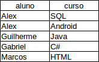
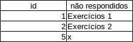
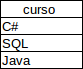
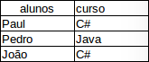

# Alunos sem matrícula e o Exists 

Para a segunda parte de nosso curso utilizaremos um conjunto de dados de um sistema de ensino online como exemplo. Não se preocupe, pois disponilizaremos o arquivo para que você baixe e execute o script com todas as tabelas.
 
Continuaremos usando o terminal do MySQL durante o curso, porém, se você prefere uma outra interface, como por exemplo o *MySQL Workbench*, fique a vontade e usar o que for melhor para você.

Abra o terminal do MySQL com o comando `mysql -uroot -p` e crie a base de dados escola.

```
create database escola

Query OK, 1 row affected (0,01 sec)
``` 

Agora que criamos a nossa base de dados, podemos importar o arquivo .sql já existente. Saia do terminal e execute o arquivo na base de dados escola.

```
mysql -u root -p escola < escola.sql
```

Com o arquivo importado, podemos abrir novamente o MySQL, porém selecione a base de dados escoola.

```
mysql -u root -p escola
```

Para verificar todas as tabelas da nossa base de dados podemos utilizar o instrução `SHOW TABLES` do MySQL:

```
SHOW TABLES;

+------------------+
| Tables_in_escola |
+------------------+
| aluno            |
| curso            |
| exercicio        |
| matricula        |
| nota             |
| resposta         |
| secao            |
+------------------+
7 rows in set (0,00 sec)
```

Sabemos quais são as tabelas, porém precisamos saber mais sobre a estrutura dessas tabelas, então vamos utilizar a instrução `DESC`. Vamos verificar primeiro a tabela aluno:

```
DESC aluno;

+-------+--------------+------+-----+---------+----------------+
| Field | Type         | Null | Key | Default | Extra          |
+-------+--------------+------+-----+---------+----------------+
| id    | int(11)      | NO   | PRI | NULL    | auto_increment |
| nome  | varchar(255) | NO   |     |         |                |
| email | varchar(255) | NO   |     |         |                |
+-------+--------------+------+-----+---------+----------------+
```

Perceba que é uma tabela bem simples, onde serão armazenadas apenas as informações dos alunos. Vamos verificar a tabela curso:

```
DESC curso;

+-------+--------------+------+-----+---------+----------------+
| Field | Type         | Null | Key | Default | Extra          |
+-------+--------------+------+-----+---------+----------------+
| id    | int(11)      | NO   | PRI | NULL    | auto_increment |
| nome  | varchar(255) | NO   |     |         |                |
+-------+--------------+------+-----+---------+----------------+
```

Da mesma forma que a tabela `aluno`, a tabela `curso` armazenada apenas as informações dos cursos. Agora vamos verificar a tabela matricula:

```
DESC matricula;

+----------+-------------+------+-----+---------+----------------+
| Field    | Type        | Null | Key | Default | Extra          |
+----------+-------------+------+-----+---------+----------------+
| id       | int(11)     | NO   | PRI | NULL    | auto_increment |
| aluno_id | int(11)     | NO   |     | NULL    |                |
| curso_id | int(11)     | NO   |     | NULL    |                |
| data     | datetime    | NO   |     | NULL    |                |
| tipo     | varchar(20) | NO   |     |         |                |
+----------+-------------+------+-----+---------+----------------+
```

Conseguimos achar a primeira associação das tabelas, ou seja, a coluna `aluno_id` referencia a tabela `aluno` e a coluna `curso_id` referencia a tabela `curso`. Então vamos verificar quais são todos os cursos de um aluno. Para uma melhor compreensão de como é o resultado esperado dessa *query*, veja a planilha a seguir:



Como podemos ver, nós temos a lista de alunos e seus respectivos cursos. Então vamos começar a retornar todos os alunos que possuem uma matrícula, ou seja, vamos fazer um `JOIN` entre a tabela `aluno` e `matricula`:

```
SELECT a.nome FROM aluno a 
JOIN matricula m ON m.aluno_id = a.id;

+-----------------+
| nome            |
+-----------------+
| João da Silva   |
| Frederico José  |
| Alberto Santos  |
| Renata Alonso   |
| Paulo José      |
| Manoel Santos   |
| Renata Ferreira |
| Paula Soares    |
| Renata Alonso   |
| Manoel Santos   |
| João da Silva   |
| Frederico José  |
| Alberto Santos  |
| Frederico José  |
+-----------------+
```

Perceba que utilizamos `a.nome`, `m.aluno_id` e `a.id`, afinal, o que significa? Quando escrevemos `aluno a`, significa que estamos "apelidando" a tabela `aluno`, ou seja, todas as vezes que utilizarmos `a.alguma_coisa`, estaremos pegando alguma coluna da tabela `aluno`! Em SQL, esses "apelidos" são conhecidos como *Alias*.

Os alunos foram retornados. Então agora vamos juntar a tabela `curso` e `aluno` com a tabela `matricula` ao mesmo tempo, porém, dessa vez vamos retornar o nome do aluno e o nome do curso:

```
SELECT a.nome, c.nome FROM aluno a 
JOIN matricula m ON m.aluno_id = a.id
JOIN curso c ON m.curso_id = c.id;

+-----------------+------------------------------------+
| nome            | nome                               |
+-----------------+------------------------------------+
| João da Silva   | SQL e banco de dados               |
| Frederico José  | SQL e banco de dados               |
| Alberto Santos  | Scrum e métodos ágeis              |
| Renata Alonso   | C# e orientação a objetos          |
| Paulo José      | SQL e banco de dados               |
| Manoel Santos   | Scrum e métodos ágeis              |
| Renata Ferreira | Desenvolvimento web com VRaptor    |
| Paula Soares    | Desenvolvimento mobile com Android |
| Renata Alonso   | Desenvolvimento mobile com Android |
| Manoel Santos   | SQL e banco de dados               |
| João da Silva   | C# e orientação a objetos          |
| Frederico José  | C# e orientação a objetos          |
| Alberto Santos  | C# e orientação a objetos          |
| Frederico José  | Desenvolvimento web com VRaptor    |
+-----------------+-------------------|-----------------+
```

Vamos verificar quantos alunos nós temos na nossa base de dados:

```
SELECT COUNT(*) FROM aluno;

+----------+
| COUNT(*) |
+----------+
|       16 |
+----------+
```

## Subqueries

Observe que foram retornadas 14 linhas quando buscamos todos os alunos e seus cursos, ou seja, existem alunos que não tem matrícula! Como podemos verificar quais são os alunos que não estão matriculados? No MySQL, podemos utilizar a função `EXISTS()` para verificar se existe algum registro de acordo com uma determinada *query*:

```
SELECT a.nome FROM aluno a
WHERE EXISTS (SELECT m.id FROM matricula m WHERE m.aluno_id = a.id);

+-----------------+
| nome            |
+-----------------+
| João da Silva   |
| Frederico José  |
| Alberto Santos  |
| Renata Alonso   |
| Paulo José      |
| Manoel Santos   |
| Renata Ferreira |
| Paula Soares    |
+-----------------+
```

Repare que escrevemos uma *query* dentro de uma função, quando fazemos esse tipo de *query* chamamos de *subquery*. Mas o que aconteceu exatamente nessa *query*? Quando utilizamos o `EXISTS()` indicamos que queremos o retorno de todos os alunos nomes dos alunos (`a.nome`) que estão na tabela `aluno`, porém, queremos apenas se existir uma matrícula para esse aluno `EXISTS(SELECT m.id FROM matricula m WHERE m.aluno_id = a.id)`. 

Perceba que novamente estamos retornando os alunos matriculados sendo que precisamos dos alunos que não estão matriculados. Nesse caso, podemos utilizar a instrução `NOT` para fazer a negação, ou seja, para retornar os alunos que **não** possuem matrícula:

```
SELECT a.nome FROM aluno a
WHERE NOT EXISTS (SELECT m.id FROM matricula m WHERE m.aluno_id = a.id);

+------------------+
| nome             |
+------------------+
| Paulo da Silva   |
| Carlos Cunha     |
| Jose da Silva    |
| Danilo Cunha     |
| Zilmira José     |
| Cristaldo Santos |
| Osmir Ferreira   |
| Claudio Soares   |
+------------------+
```

Conseguimos achar todos alunos que fazem parte do sistema e que não possuem uma matrícula, algo que não é esperado... Provavelmente esses alunos haviam cancelado a matrícula mas ainda sim, existia o cadastro deles, sabendo dessas informações temos a capacidade de criar relatórios com informações relevantes para, por exemplo, o setor comercial dessa instituição entrar em contato com os alunos não matriculados e tentar efetuar uma venda. 

A instituição subiu alguns exercícios e precisa saber quais desses exercícios não foram respondidos. Vamos novamente observar o resultado que se espera utilizando uma planilha como exemplo:



Como havíamos visto anteriormente, existem as tabelas, `exercicio` e `resposta`, vamos uma olhada na tabela `exercicio`:

```
DESC exercicio;

+------------------+--------------+------+-----+---------+----------------+
| Field            | Type         | Null | Key | Default | Extra          |
+------------------+--------------+------+-----+---------+----------------+
| id               | int(11)      | NO   | PRI | NULL    | auto_increment |
| secao_id         | int(11)      | NO   |     | NULL    |                |
| pergunta         | varchar(255) | NO   |     | NULL    |                |
| resposta_oficial | varchar(255) | NO   |     | NULL    |                |
+------------------+--------------+------+-----+---------+----------------+
```

Agora a tabela `respostas`:

```
DESC resposta;

+---------------+--------------+------+-----+---------+----------------+
| Field         | Type         | Null | Key | Default | Extra          |
+---------------+--------------+------+-----+---------+----------------+
| id            | int(11)      | NO   | PRI | NULL    | auto_increment |
| exercicio_id  | int(11)      | YES  |     | NULL    |                |
| aluno_id      | int(11)      | YES  |     | NULL    |                |
| resposta_dada | varchar(255) | YES  |     | NULL    |                |
+---------------+--------------+------+-----+---------+----------------+
```

Novamente encontramos uma outra associação, porém agora é entre exercicio e resposta. Então vamos pegar todos os exercícios que não foram respondidos utilizando novamente o `NOT EXISTS`:

```
SELECT * FROM exercicio e 
WHERE NOT EXISTS (SELECT r.id FROM resposta r WHERE r.exercicio_id = e.id);

+----+----------+------------------------------+------------------------------------------------------+
| id | secao_id | pergunta                     | resposta_oficial                                     |
+----+----------+------------------------------+------------------------------------------------------+
|  8 |        4 | como funciona?               | insert into (coluna1, coluna2) values (v1, v2)       |
|  9 |        5 | Como funciona a web?         | requisicao e resposta                                |
| 10 |        5 | Que linguagens posso ajudar? | varias, java, php, c#, etc                           |
| 11 |        6 | O que eh MVC?                | model view controller                                |
| 12 |        6 | Frameworks que usam?         | vraptor, spring mvc, struts, etc                     |
| 14 |        8 | O que é um interceptor?      | eh como se fosse um filtro que eh executado antes    |
| 15 |        8 | quando usar?                 | tratamento de excecoes, conexao com o banco de dados |
+----+----------+------------------------------+------------------------------------------------------+
```

Se quisermos retornar da mesma forma que fizemos no exemplo da planilha, basta informar os campos desejados:

```
SELECT e.id, e.pergunta FROM exercicio e 
WHERE NOT EXISTS (SELECT r.id FROM resposta r WHERE r.exercicio_id = e.id);

+----+------------------------------+
| id | pergunta                     |
+----+------------------------------+
|  8 | como funciona?               |
|  9 | Como funciona a web?         |
| 10 | Que linguagens posso ajudar? |
| 11 | O que eh MVC?                |
| 12 | Frameworks que usam?         |
| 14 | O que é um interceptor?      |
| 15 | quando usar?                 |
+----+------------------------------+
``` 

O pessoal do comercial da instituição, informou que existem alguns cursos que não tem nenhuma matrícula. Vamos verificar como é esperado desse resultado pela nossa planilha:



Da mesma forma que retornamos todos os exercícios que não tinha respostas, podemos retornar todos os cursos que não possuem matrícula:

```
SELECT c.nome FROM curso c 
WHERE NOT EXISTS(SELECT m.id FROM matricula m WHERE m.curso_id = c.id);

+--------------------------------+
| nome                           |
+--------------------------------+
| Java e orientação a objetos    |
| Desenvolvimento mobile com iOS |
| Ruby on Rails                  |
| PHP e MySql                    |
+--------------------------------+
```


Veja que *queries* muito parecidas podem resolver problemas diferentes!

A instituição informou que tiveram vários exercícios que não foram respondidos pelos alunos nos cursos que foram realizados recentemente. Vamos verificar quem foram esses alunos, para verificarmos o motivo de não ter respondido, se foi um problema no sistema ou na base de dados... Novamente vamos verificar o que se espera desse resultado numa planilha:



Vamos tentar fazer essa *query*. Começaremos retornando o aluno juntando a tabela `aluno` com a tabela `matricula`.

```
SELECT a.nome FROM aluno a 
JOIN matricula m ON m.aluno_id = a.id
```

Agora vamos juntar também a tabela `curso` e retornar os cursos também:

```
SELECT a.nome, c.nome FROM aluno a 
JOIN matricula m ON m.aluno_id = a.id
JOIN curso c ON m.curso_id = c.id
```

Vamos testar e verificar como está a nossa *query* atualmente:

```
+-----------------+------------------------------------+
| nome            | nome                               |
+-----------------+------------------------------------+
| João da Silva   | SQL e banco de dados               |
| Frederico José  | SQL e banco de dados               |
| Alberto Santos  | Scrum e métodos ágeis              |
| Renata Alonso   | C# e orientação a objetos          |
| Paulo José      | SQL e banco de dados               |
| Manoel Santos   | Scrum e métodos ágeis              |
| Renata Ferreira | Desenvolvimento web com VRaptor    |
| Paula Soares    | Desenvolvimento mobile com Android |
| Renata Alonso   | Desenvolvimento mobile com Android |
| Manoel Santos   | SQL e banco de dados               |
| João da Silva   | C# e orientação a objetos          |
| Frederico José  | C# e orientação a objetos          |
| Alberto Santos  | C# e orientação a objetos          |
| Frederico José  | Desenvolvimento web com VRaptor    |
+-----------------+------------------------------------+
```

Aparentemente está tudo certo, porém ainda precisamos informar que queremos apenas os alunos que não responderam os exercícios desses de algum desses cursos. Então adicionaremos agora o `NOT EXISTS()`:

```
SELECT a.nome, c.nome FROM aluno a 
JOIN matricula m ON m.aluno_id = a.id
JOIN curso c ON m.curso_id = c.id
WHERE NOT EXISTS(SELECT r.aluno_id 
FROM resposta r WHERE r.aluno_id = a.id);

+-----------------+------------------------------------+
| nome            | nome                               |
+-----------------+------------------------------------+
| Paulo José      | SQL e banco de dados               |
| Manoel Santos   | Scrum e métodos ágeis              |
| Renata Ferreira | Desenvolvimento web com VRaptor    |
| Paula Soares    | Desenvolvimento mobile com Android |
| Manoel Santos   | SQL e banco de dados               |
+-----------------+------------------------------------+
```

Há uma regra no sistema em que não pode permitir que alunos que não estejam matriculados resposdam os exercícios, ou seja, não pode existir uma resposta na tabela `resposta` com um id de um aluno (`aluno_id`) que não esteja matriculado. Vamos primeiro verificar todos os alunos **matriculados** que responderam os exercícios:

```
SELECT r.id, a.nome FROM aluno a
JOIN resposta r ON r.aluno_id = a.id
WHERE EXISTS(SELECT m.aluno_id FROM matricula m 
WHERE m.aluno_id = a.id);

+----+-----------------+
| id | nome            |
+----+-----------------+
|  1 | João da Silva   |
|  2 | João da Silva   |
|  3 | João da Silva   |
|  4 | João da Silva   |
|  5 | João da Silva   |
|  6 | João da Silva   |
|  7 | João da Silva   |
|  8 | Frederico José  |
|  9 | Frederico José  |
| 10 | Frederico José  |
| 11 | Frederico José  |
| 12 | Alberto Santos  |
| 13 | Alberto Santos  |
| 14 | Alberto Santos  |
| 15 | Alberto Santos  |
| 16 | Alberto Santos  |
| 17 | Alberto Santos  |
| 18 | Alberto Santos  |
| 19 | Alberto Santos  |
| 20 | Alberto Santos  |
| 21 | Renata Alonso   |
| 22 | Renata Alonso   |
| 23 | Renata Alonso   |
| 24 | Renata Alonso   |
| 25 | Renata Alonso   |
| 26 | Renata Alonso   |
| 27 | Renata Alonso   |
+----+-----------------+
```

Observe que repetiu alguns alunos, pois um aluno respondeu mais de uma questão. Vamos verificar agora os que responderam, poŕem **não estão matriculados**:

```
SELECT r.id, a.nome FROM aluno a
JOIN resposta r ON r.aluno_id = a.id
WHERE NOT EXISTS(SELECT m.aluno_id FROM matricula m 
WHERE m.aluno_id = a.id);

Empty set (0,00 sec)
```

O resultado saiu conforme o esperado, isso significa, que não existem respostas de alunos que não possuem matrícula! 

## Resumindo

Nesse capítulo aprendemos a criar *queries* capazes de retornar valores caso exista, ou não, uma associação entre duas tabelas, como por exemplo, se um aluno está matriculado ou se um aluno respondeu algum exercício por meio da função `EXISTS()`. Aprendemos também o que são *subqueries* como no exemplo em que passamos uma *query* como parâmetro para a função `EXISTS()` resolver diversos problemas, além disso, analisamos que várias *queries* "similadres" tem a capacidade de resolver problemas distintos utilizando o `EXISTS()`. Vamos para os exercícios?   

# Exercícios

1. Baixe o schema do banco de dados <a href="https://s3.amazonaws.com/caelum-online-public/alura-sql/curso-2/scripts/escola.sql">aqui</a>

Crie o banco de dados `escola`:

`create database escola`

Importe-o no seu Mysql com o seguinte comando, direto no terminal:

```
mysql -u root -p escola < escola.sql
```

Faça um SELECT qualquer para garantir que os dados estão lá.

DICA: Salve o arquivo `escola.sql` em um lugar de fácil acesso pelo terminal. Você deve rodar o comando para importar o schema no mesmo lugar onde estar o aquivo `escola.sql`. Por exemplo, salve o arquivo SQL na pasta `\alura-mysql`. Depois abra um terminal e entre nessa pasta:

```
cd \aula-mysql
mysql -u root -p escola < escola.sql
```
No Windows você pode usar o comando `dir` é para listar os arquivos da pasta atual na linha de comando. Ou seja, ao executar `dir` na pasta `aula-mysql` você deve encontrar o arquivo  `escola.sql`.

2. Busque todos os alunos que não tenham nenhuma matrícula nos cursos.

3. Busque todos os alunos que não tiveram nenhuma matrícula nos últimos 45 dias, usando a instrução `EXISTS`.

4. É possível fazer a mesma consulta sem usar `EXISTS`? Quais são?

