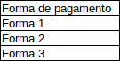
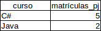

# Múltiplos valores na condição e o IN

O setor de financeiro dessa instituição, solicitou um relatório informando todas as formas de pagamento cadastradas no banco de dados para verificar se está de acordo com o que eles trabalham. Na base de dados, se verificarmos a tabela `matricula`:

```
DESC matricula;

+----------+-------------+------+-----+---------+----------------+
| Field    | Type        | Null | Key | Default | Extra          |
+----------+-------------+------+-----+---------+----------------+
| id       | int(11)     | NO   | PRI | NULL    | auto_increment |
| aluno_id | int(11)     | NO   |     | NULL    |                |
| curso_id | int(11)     | NO   |     | NULL    |                |
| data     | datetime    | NO   |     | NULL    |                |
| tipo     | varchar(20) | NO   |     |         |                |
+----------+-------------+------+-----+---------+----------------+
``` 

Observe que existe a coluna `tipo` que representa qual é a forma de pagamento. E precisamos pegar um relatório da seguinte maneira:



Vamos selecionar apenas a coluna `tipo` da tabela `matricula`:

```
SELECT m.tipo FROM matricula m;

+-------------+
| tipo        |
+-------------+
| PAGA_PF     |
| PAGA_PJ     |
| PAGA_PF     |
| PAGA_CHEQUE |
| PAGA_BOLETO |
| PAGA_PJ     |
| PAGA_PF     |
| PAGA_PJ     |
| PAGA_PJ     |
| PAGA_CHEQUE |
| PAGA_BOLETO |
| PAGA_PJ     |
| PAGA_PF     |
| PAGA_PJ     |
+-------------+
```

Veja que foram retornados tipos de pagamento iguais, porém precisamos enviar um relatório apenas com os tipos de pagamento **distintos**. Para retornamos os valores distintos de uma coluna podemos utilizar a instrução `DISTINCT`:

```
SELECT DISTINCT m.tipo FROM matricula m;

+-------------+
| tipo        |
+-------------+
| PAGA_PF     |
| PAGA_PJ     |
| PAGA_CHEQUE |
| PAGA_BOLETO |
+-------------+
```

Conseguimos retornar o relatório das formas de pagamento, porém o setor financeiro ainda precisa saber de mais informações. Agora foi solicitado que enviasse um relatório com os cursos e a quantidade de alunos que possuem o tipo de pagamento PJ. Vamos verificar o exemplo em uma planilha:



Sabemos que o relatório é sobre a quantidade de matrículas que foram pagas como PJ, precisamos contar, ou seja, usaremos a função `COUNT()`. Vamos começar a contar a quantidade de matrículas:

```
SELECT COUNT(m.id) FROM matricula m;

+-------------+
| COUNT(m.id) |
+-------------+
|          14 |
+-------------+
```

Agora vamos juntar com a tabela `curso` e exibir o nome do curso:

```
SELECT c.nome, COUNT(m.id) FROM matricula m
JOIN curso c ON m.curso_id = c.id;

+----------------------+-------------+
| nome                 | COUNT(m.id) |
+----------------------+-------------+
| SQL e banco de dados |          14 |
+----------------------+-------------+
```

Observe que foi retornado apenas uma linha! Isso significa que a função `COUNT()` também é uma função de agregação, ou seja, se queremos adicionar mais colunas na nossa *query*, precisamos agrupá-las. Então vamos agrupar o nome do curso:

```
SELECT c.nome, COUNT(m.id) FROM matricula m
JOIN curso c ON m.curso_id = c.id
GROUP BY c.nome;

+------------------------------------+-------------+
| nome                               | COUNT(m.id) |
+------------------------------------+-------------+
| C# e orientação a objetos          |           4 |
| Desenvolvimento mobile com Android |           2 |
| Desenvolvimento web com VRaptor    |           2 |
| Scrum e métodos ágeis              |           2 |
| SQL e banco de dados               |           4 |
+------------------------------------+-------------+
```

Conseguimos retornar todas os cursos e a quantidade de matrículas, porém precisamos filtrar por tipo de pagamento PJ. Então vamos adicionar um `WHERE`:

```
SELECT c.nome, COUNT(m.id) FROM matricula m
JOIN curso c ON m.curso_id = c.id
WHERE m.tipo = 'PAGA_PJ'
GROUP BY c.nome;

+------------------------------------+-------------+
| nome                               | COUNT(m.id) |
+------------------------------------+-------------+
| C# e orientação a objetos          |           1 |
| Desenvolvimento mobile com Android |           2 |
| Desenvolvimento web com VRaptor    |           1 |
| Scrum e métodos ágeis              |           1 |
| SQL e banco de dados               |           1 |
+------------------------------------+-------------+
``` 

# Filtros utilizando o IN

O setor financeiro da instituição precisa de mais detalhes sobre os tipos de pagamento de cada curso, eles precisam de um relatório similar ao que fizemos, porém para todos que sejam pagamento PJ e PF. Para diferenciar o tipo de pagamento, precisaremos adicionar a coluna do `m.tipo`:

```
SELECT c.nome, COUNT(m.id), m.tipo 
FROM matricula m
JOIN curso c ON m.curso_id = c.id
WHERE m.tipo = 'PAGA_PJ'
OR m.tipo = 'PAGA_PF'
GROUP BY c.nome, m.tipo;

+------------------------------------+-------------+---------+
| nome                               | COUNT(m.id) | tipo    |
+------------------------------------+-------------+---------+
| C# e orientação a objetos          |           1 | PAGA_PF |
| C# e orientação a objetos          |           1 | PAGA_PJ |
| Desenvolvimento mobile com Android |           2 | PAGA_PJ |
| Desenvolvimento web com VRaptor    |           1 | PAGA_PF |
| Desenvolvimento web com VRaptor    |           1 | PAGA_PJ |
| Scrum e métodos ágeis              |           1 | PAGA_PF |
| Scrum e métodos ágeis              |           1 | PAGA_PJ |
| SQL e banco de dados               |           1 | PAGA_PF |
| SQL e banco de dados               |           1 | PAGA_PJ |
+------------------------------------+-------------+---------+
```

Suponhamos que agora precisamos retornar também os que foram pagos em boleto ou cheque. O que poderíamos adicionar na *query*? Mais `OR`s?

```
SELECT c.nome, COUNT(m.id), m.tipo 
FROM matricula m
JOIN curso c ON m.curso_id = c.id
WHERE m.tipo = 'PAGA_PJ'
OR m.tipo = 'PAGA_PF'
OR m.tipo = 'PAGA_BOLETO'
OR m.tipo = 'PAGA_CHEQUE'
OR m.tipo = '...'
OR m.tipo = '...'
GROUP BY c.nome, m.tipo;
```

Resolveria, mas perceba que a nossa *query* a cada novo tipo de pagamento a nossa query tende a crescer, dificultando a leitura... Em SQL, existe a instrução `IN` que permite especificarmos mais de um valor que precisamos filtrar ao mesmo tempo para uma determinada coluna:

```
SELECT c.nome, COUNT(m.id), m.tipo 
FROM matricula m
JOIN curso c ON m.curso_id = c.id
WHERE m.tipo IN ('PAGA_PJ', 'PAGA_PF', 'PAGA_CHEQUE', 'PAGA_BOLETO')
GROUP BY c.nome, m.tipo;

+------------------------------------+-------------+-------------+
| nome                               | COUNT(m.id) | tipo        |
+------------------------------------+-------------+-------------+
| C# e orientação a objetos          |           1 | PAGA_BOLETO |
| C# e orientação a objetos          |           1 | PAGA_CHEQUE |
| C# e orientação a objetos          |           1 | PAGA_PF     |
| C# e orientação a objetos          |           1 | PAGA_PJ     |
| Desenvolvimento mobile com Android |           2 | PAGA_PJ     |
| Desenvolvimento web com VRaptor    |           1 | PAGA_PF     |
| Desenvolvimento web com VRaptor    |           1 | PAGA_PJ     |
| Scrum e métodos ágeis              |           1 | PAGA_PF     |
| Scrum e métodos ágeis              |           1 | PAGA_PJ     |
| SQL e banco de dados               |           1 | PAGA_BOLETO |
| SQL e banco de dados               |           1 | PAGA_CHEQUE |
| SQL e banco de dados               |           1 | PAGA_PF     |
| SQL e banco de dados               |           1 | PAGA_PJ     |
+------------------------------------+-------------+-------------+
```

Se um novo tipo de pagamento for adicionado, basta adicionarmos dentro do `IN` e a nossa *query* funcionará corretamente.

A instituição nomeou 3 alunos como os mais destacados nos últimos cursos realizamos e gostaria de saber quais foram todos os cursos que eles fizeram. Os 3 alunos que se destacaram foram: João da Silva, Alberto Santos e a Renata Alonso. Vamos verificar quais são os `id`s desses alunos:

```
SELECT * FROM aluno;

+----+------------------+----------------------+
| id | nome             | email                |
+----+------------------+----------------------+
|  1 | João da Silva    | joao@dasilva.com     |
|  2 | Frederico José   | fred@jose.com        |
|  3 | Alberto Santos   | alberto@santos.com   |
|  4 | Renata Alonso    | renata@alonso.com    |
|  5 | Paulo da Silva   | paulo@dasilva.com    |
|  6 | Carlos Cunha     | carlos@cunha.com     |
|  7 | Paulo José       | paulo@jose.com       |
|  8 | Manoel Santos    | manoel@santos.com    |
|  9 | Renata Ferreira  | renata@ferreira.com  |
| 10 | Paula Soares     | paula@soares.com     |
| 11 | Jose da Silva    | jose@dasilva.com     |
| 12 | Danilo Cunha     | danilo@cunha.com     |
| 13 | Zilmira José     | Zilmira@jose.com     |
| 14 | Cristaldo Santos | cristaldo@santos.com |
| 15 | Osmir Ferreira   | osmir@ferreira.com   |
| 16 | Claudio Soares   | claudio@soares.com   |
+----+------------------+----------------------+
```

O aluno João da Silva é 1, Alberto Santos 3 e Renata Alonso 4. Agora que sabemos os `id`s podemos verificar os seus cursos. Então vamos começar a nossa *query* retornando todos os cursos:

```
SELECT c.nome FROM curso c;
```

Agora vamos juntar o curso com a matrícula:

```
SELECT c.nome FROM curso c
JOIN matricula m ON m.curso_id = c.id;
```

Por fim, vamos juntar a matricula com o aluno e retornar o nome do aluno:

```
SELECT a.nome, c.nome FROM curso c
JOIN matricula m ON m.curso_id = c.id
JOIN aluno a ON m.aluno_id = a.id;
```

Fizemos todas as junções, agora só precisamos do filtro. Precisamos retornar os cursos dos **3 alunos ao mesmo tempo**, podemos utilizar a instrução `IN`:

```
SELECT a.nome, c.nome FROM curso c
JOIN matricula m ON m.curso_id = c.id
JOIN aluno a ON m.aluno_id = a.id
WHERE a.id IN (1,3,4);

+----------------+------------------------------------+
| nome           | nome                               |
+----------------+------------------------------------+
| João da Silva  | SQL e banco de dados               |
| Alberto Santos | Scrum e métodos ágeis              |
| Renata Alonso  | C# e orientação a objetos          |
| Renata Alonso  | Desenvolvimento mobile com Android |
| João da Silva  | C# e orientação a objetos          |
| Alberto Santos | C# e orientação a objetos          |
+----------------+------------------------------------+
```

Retornamos todos os cursos dos 3 alunos, porém ainda tá um pouco desorganizado, então vamos ordenar pelo nome dos alunos utilizando o `ORDER BY`:

```
SELECT a.nome, c.nome FROM curso c
JOIN matricula m ON m.curso_id = c.id
JOIN aluno a ON m.aluno_id = a.id
WHERE a.id IN (1,3,4)
ORDER BY a.nome;

+----------------+------------------------------------+
| nome           | nome                               |
+----------------+------------------------------------+
| Alberto Santos | Scrum e métodos ágeis              |
| Alberto Santos | C# e orientação a objetos          |
| João da Silva  | SQL e banco de dados               |
| João da Silva  | C# e orientação a objetos          |
| Renata Alonso  | C# e orientação a objetos          |
| Renata Alonso  | Desenvolvimento mobile com Android |
+----------------+------------------------------------+
```

Na instituição, serão lançados alguns cursos novos de *.NET* e o pessoal do comercial precisa divulgar esses cursos para os ex-alunos, porém apenas para os ex-alunos que já fizeram os cursos de C# e de SQL. Inicialmente vamos verificar os `id`s desses cursos:

```
SELECT * FROM curso;

+----+------------------------------------+
| id | nome                               |
+----+------------------------------------+
|  1 | SQL e banco de dados               |
|  2 | Desenvolvimento web com VRaptor    |
|  3 | Scrum e métodos ágeis              |
|  4 | C# e orientação a objetos          |
|  5 | Java e orientação a objetos        |
|  6 | Desenvolvimento mobile com iOS     |
|  7 | Desenvolvimento mobile com Android |
|  8 | Ruby on Rails                      |
|  9 | PHP e MySql                        |
+----+------------------------------------+
```

Curso de SQL é 1 e o curso de C# é 4. Construindo a nossa *query*, começaremos retornando o aluno:

``` 
SELECT a.nome FROM aluno a;
```

Então juntamos com a matricula e o curso e vamos retornar quais foram os cursos realizados:

```
SELECT a.nome, c.nome FROM aluno a
JOIN matricula m ON m.aluno_id = a.id
JOIN curso c ON m.curso_id = c.id;
```

Agora utilizaremos o filtro para retornar tanto o curso de SQL(1), quanto o curso de C#(4):

```
SELECT a.nome, c.nome FROM aluno a
JOIN matricula m ON m.aluno_id = a.id
JOIN curso c ON m.curso_id = c.id
WHERE c.id IN (1, 4);

+-----------------+-----------------------------+
| nome            | nome                        |
+-----------------+-----------------------------+
| João da Silva   | SQL e banco de dados        |
| Frederico José  | SQL e banco de dados        |
| Renata Alonso   | C# e orientação a objetos   |
| Paulo José      | SQL e banco de dados        |
| Manoel Santos   | SQL e banco de dados        |
| João da Silva   | C# e orientação a objetos   |
| Frederico José  | C# e orientação a objetos   |
| Alberto Santos  | C# e orientação a objetos   |
+-----------------+-----------------------------+
```

Novamente o resultado está desordenado, vamos ordenar pelo nome do aluno:

```
SELECT a.nome, c.nome FROM aluno a
JOIN matricula m ON m.aluno_id = a.id
JOIN curso c ON m.curso_id = c.id
WHERE c.id IN (1, 4)
ORDER BY a.nome;

+-----------------+-----------------------------+
| nome            | nome                        |
+-----------------+-----------------------------+
| Alberto Santos  | C# e orientação a objetos   |
| Frederico José  | SQL e banco de dados        |
| Frederico José  | C# e orientação a objetos   |
| João da Silva   | SQL e banco de dados        |
| João da Silva   | C# e orientação a objetos   |
| Manoel Santos   | SQL e banco de dados        |
| Paulo José      | SQL e banco de dados        |
| Renata Alonso   | C# e orientação a objetos   |
+-----------------+-----------------------------+
```

Agora sabemos que apenas os alunos Frederico José e João da Silva, são os ex-alunos aptos para realizar os novos cursos de *.NET*.

## Resumindo

Nesse capítulo vimos que quando precisamos saber todos os valores de uma determinada coluna podemos utilizar a instrução `DISTINCT` para retornar todos os valores **distintos**, ou seja, sem nenhuma repetição. Vimos também que quando precisamos realizar vários filtros para uma mesma coluna, podemos utilizar a instrução `IN` passando por parâmetro todos os valores que esperamos que seja retornado, ao invés de ficar preenchendo a nossa *query* com vários `OR`s. Vamos para os exercícios?

# Exercícios

1. Exiba todos os tipos de matrícula que existem na tabela. Use DISTINCT para que não haja repetição.

2. Exiba todos os cursos e a sua quantidade de matrículas. Mas filtre por matrículas dos tipos PF ou PJ.

3. Traga todas as perguntas e a quantidade de respostas de cada uma. Mas dessa vez, somente dos cursos com ID 1 e 3.