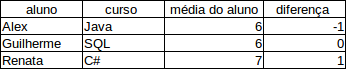
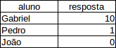

# Sub-queries

A instituição precisa de um relatório mais robusto, com as seguintes informações: Precisa do nome do aluno e curso, a média do aluno em relação ao curso e a diferença entre a média do aluno e a média geral do curso. Demonstrando em uma planilha, o resultado que se espera é o seguinte:



Observe que o aluno Alex fez o curso de Java tirou 6 de média e a diferença entre a média dele e a média geral para o curso de Java foi -1, isso significa que a média geral do curso de Java é 7, ou seja, 6 - 7. Vamos analisar o aluno Guilherme, veja que ele tirou 6 de média e a diferença foi 0, pois a média geral do curso de SQL é 6, ou seja, 6 - 6. Por fim, a aluna Renata tirou média 7 no curso de C#, porém a diferença foi 1, isso significa que a média geral é 6, ou seja, 7 - 6.

Como você montaria essa *query*? Aparentemente é um pouco complexa... Então vamos começar por partes da mesma forma que fizemos anteriormente. Começaremos pela tabela `nota`:

```
SELECT n.nota FROM nota n;
```

Agora vamos juntar as tabelas `resposta` e `exercicio` e vamos verificar o resultado:

```
SELECT n.nota FROM nota n
JOIN resposta r ON n.resposta_id = r.id
JOIN exercicio e ON r.exercicio_id = e.id;

+-------+
| nota  |
+-------+
|  8.00 |
|  0.00 |
|  7.00 |
|  6.00 |
|  9.00 |
| 10.00 |
|  4.00 |
|  4.00 |
|  7.00 |
|  8.00 |
|  6.00 |
|  7.00 |
|  4.00 |
|  9.00 |
|  3.00 |
|  5.00 |
|  5.00 |
|  5.00 |
|  6.00 |
|  8.00 |
|  8.00 |
|  9.00 |
| 10.00 |
|  2.00 |
|  0.00 |
|  1.00 |
|  4.00 |
+-------+
```

A nossa *query* está funcionando. Vamos adicionar as tabelas de `secao` e `curso`, porém, dessa vez vamos adicionar o nome do curso:

```
SELECT c.nome, n.nota FROM nota n
JOIN resposta r ON n.resposta_id = r.id
JOIN exercicio e ON r.exercicio_id = e.id
JOIN secao s ON e.secao_id = s.id
JOIN curso c ON s.curso_id = c.id;

+---------------------------------+-------+
| nome                            | nota  |
+---------------------------------+-------+
| SQL e banco de dados            |  8.00 |
| SQL e banco de dados            |  0.00 |
| SQL e banco de dados            |  7.00 |
| SQL e banco de dados            |  6.00 |
| SQL e banco de dados            |  9.00 |
| SQL e banco de dados            | 10.00 |
| SQL e banco de dados            |  4.00 |
| SQL e banco de dados            |  4.00 |
| SQL e banco de dados            |  7.00 |
| Desenvolvimento web com VRaptor |  8.00 |
| SQL e banco de dados            |  6.00 |
| Scrum e métodos ágeis           |  7.00 |
| Scrum e métodos ágeis           |  4.00 |
| Scrum e métodos ágeis           |  9.00 |
| Scrum e métodos ágeis           |  3.00 |
| Scrum e métodos ágeis           |  5.00 |
| Scrum e métodos ágeis           |  5.00 |
| Scrum e métodos ágeis           |  5.00 |
| Scrum e métodos ágeis           |  6.00 |
| Scrum e métodos ágeis           |  8.00 |
| C# e orientação a objetos       |  8.00 |
| C# e orientação a objetos       |  9.00 |
| C# e orientação a objetos       | 10.00 |
| C# e orientação a objetos       |  2.00 |
| C# e orientação a objetos       |  0.00 |
| C# e orientação a objetos       |  1.00 |
| C# e orientação a objetos       |  4.00 |
+---------------------------------+-------+
```

Por fim, juntaremos a tabela `aluno` com a tabela `resposta` e retornaremos o nome do aluno:

```
SELECT a.nome, c.nome, n.nota FROM nota n
JOIN resposta r ON n.resposta_id = r.id
JOIN exercicio e ON r.exercicio_id = e.id
JOIN secao s ON e.secao_id = s.id
JOIN curso c ON s.curso_id = c.id
JOIN aluno a ON r.aluno_id = a.id;

+-----------------+---------------------------------+-------+
| nome            | nome                            | nota  |
+-----------------+---------------------------------+-------+
| João da Silva   | SQL e banco de dados            |  8.00 |
| João da Silva   | SQL e banco de dados            |  0.00 |
| João da Silva   | SQL e banco de dados            |  7.00 |
| João da Silva   | SQL e banco de dados            |  6.00 |
| João da Silva   | SQL e banco de dados            |  9.00 |
| João da Silva   | SQL e banco de dados            | 10.00 |
| João da Silva   | SQL e banco de dados            |  4.00 |
| Frederico José  | SQL e banco de dados            |  4.00 |
| Frederico José  | SQL e banco de dados            |  7.00 |
| Frederico José  | Desenvolvimento web com VRaptor |  8.00 |
| Frederico José  | SQL e banco de dados            |  6.00 |
| Alberto Santos  | Scrum e métodos ágeis           |  7.00 |
| Alberto Santos  | Scrum e métodos ágeis           |  4.00 |
| Alberto Santos  | Scrum e métodos ágeis           |  9.00 |
| Alberto Santos  | Scrum e métodos ágeis           |  3.00 |
| Alberto Santos  | Scrum e métodos ágeis           |  5.00 |
| Alberto Santos  | Scrum e métodos ágeis           |  5.00 |
| Alberto Santos  | Scrum e métodos ágeis           |  5.00 |
| Alberto Santos  | Scrum e métodos ágeis           |  6.00 |
| Alberto Santos  | Scrum e métodos ágeis           |  8.00 |
| Renata Alonso   | C# e orientação a objetos       |  8.00 |
| Renata Alonso   | C# e orientação a objetos       |  9.00 |
| Renata Alonso   | C# e orientação a objetos       | 10.00 |
| Renata Alonso   | C# e orientação a objetos       |  2.00 |
| Renata Alonso   | C# e orientação a objetos       |  0.00 |
| Renata Alonso   | C# e orientação a objetos       |  1.00 |
| Renata Alonso   | C# e orientação a objetos       |  4.00 |
+-----------------+---------------------------------+-------+
```

Conseguimos retornar todas as notas do aluno e os cursos, porém nós precisamos das médias e não de todas as notas. Então vamos utilizar a função `AVG()` para retornar a média do aluno. Lembre-se que a função `AVG()` é uma função de agregação, ou seja, precisamos agrupar o aluno e o curso também:

```
SELECT a.nome, c.nome, AVG(n.nota) FROM nota n
JOIN resposta r ON n.resposta_id = r.id
JOIN exercicio e ON r.exercicio_id = e.id
JOIN secao s ON e.secao_id = s.id
JOIN curso c ON s.curso_id = c.id
JOIN aluno a ON r.aluno_id = a.id
GROUP BY a.nome, c.nome;

+-----------------+---------------------------------+-------------+
| nome            | nome                            | AVG(n.nota) |
+-----------------+---------------------------------+-------------+
| Alberto Santos  | Scrum e métodos ágeis           |    5.777778 |
| Frederico José  | Desenvolvimento web com VRaptor |    8.000000 |
| Frederico José  | SQL e banco de dados            |    5.666667 |
| João da Silva   | SQL e banco de dados            |    6.285714 |
| Renata Alonso   | C# e orientação a objetos       |    4.857143 |
+-----------------+---------------------------------+-------------+
``` 

Agora nós temos a média do aluno e seu respectivo curso, mas ainda falta a coluna da diferença que calcula a diferença entre a média do aluno em um determinado curso e subtrai pela média geral. Porém ainda não temos a média geral, então como podemos pegar a média geral? Vamos verificar a tabela `nota`:

```
SELECT * FROM nota;

+----+-------------+-------+
| id | resposta_id | nota  |
+----+-------------+-------+
|  1 |           1 |  8.00 |
|  2 |           2 |  0.00 |
|  3 |           3 |  7.00 |
|  4 |           4 |  6.00 |
|  5 |           5 |  9.00 |
|  6 |           6 | 10.00 |
|  7 |           7 |  4.00 |
|  8 |           8 |  4.00 |
|  9 |           9 |  7.00 |
| 10 |          10 |  8.00 |
| 11 |          11 |  6.00 |
| 12 |          12 |  7.00 |
| 13 |          13 |  4.00 |
| 14 |          14 |  9.00 |
| 15 |          15 |  3.00 |
| 16 |          16 |  5.00 |
| 17 |          17 |  5.00 |
| 18 |          18 |  5.00 |
| 19 |          19 |  6.00 |
| 20 |          20 |  8.00 |
| 21 |          21 |  8.00 |
| 22 |          22 |  9.00 |
| 23 |          23 | 10.00 |
| 24 |          24 |  2.00 |
| 25 |          25 |  0.00 |
| 26 |          26 |  1.00 |
| 27 |          27 |  4.00 |
+----+-------------+-------+
```

Perceba que temos todas as notas, teoricamente as notas de todos os cursos, ou seja, para pegarmos a média geral usaremos o `AVG()`:

```
SELECT AVG(n.nota) FROM nota n;

+-------------+
| AVG(n.nota) |
+-------------+
|    5.740741 |
+-------------+
```

Conseguimos a média geral, agora vamos adicionar a coluna diferença. Antes de começar a fazer a coluna diferença vamos nomear a coluna de média do aluno para melhorar a visualização:

```
SELECT a.nome, c.nome, AVG(n.nota) as media_aluno FROM nota
...
```

A coluna diferença precisa da informação da `media_aluno` - media geral, porém, nós não temos nenhuma coluna para a média geral, e o resultado que precisamos está em uma query diferente... Como podemos resolver isso? Adicionando essa outra *query* dentro da *query* principal, ou seja, fazer uma *subquery*:

```
SELECT a.nome, c.nome, AVG(n.nota) as media_aluno,
AVG(n.nota) - (SELECT AVG(n.nota) FROM nota n) as diferenca
FROM nota n
JOIN resposta r ON n.resposta_id = r.id
JOIN exercicio e ON r.exercicio_id = e.id
JOIN secao s ON e.secao_id = s.id
JOIN curso c ON s.curso_id = c.id
JOIN aluno a ON r.aluno_id = a.id
GROUP BY a.nome, c.nome;

+-----------------+---------------------------------+-------------+-----------+
| nome            | nome                            | media_aluno | diferenca |
+-----------------+---------------------------------+-------------+-----------+
| Alberto Santos  | Scrum e métodos ágeis           |    5.777778 |  0.037037 |
| Frederico José  | Desenvolvimento web com VRaptor |    8.000000 |  2.259259 |
| Frederico José  | SQL e banco de dados            |    5.666667 | -0.074074 |
| João da Silva   | SQL e banco de dados            |    6.285714 |  0.544974 |
| Renata Alonso   | C# e orientação a objetos       |    4.857143 | -0.883598 |
+-----------------+---------------------------------+-------------+-----------+
```

Observe que agora retornamos a diferença, mas será que essas informações batem? Que tal retornamos a média geral também?

```
SELECT a.nome, c.nome, AVG(n.nota) as media_aluno, 
(SELECT AVG(n.nota) FROM nota n) as media_geral,
AVG(n.nota) - (SELECT AVG(n.nota) FROM nota n) as diferenca
FROM nota n
JOIN resposta r ON n.resposta_id = r.id
JOIN exercicio e ON r.exercicio_id = e.id
JOIN secao s ON e.secao_id = s.id
JOIN curso c ON s.curso_id = c.id
JOIN aluno a ON r.aluno_id = a.id
GROUP BY a.nome, c.nome;

+-----------------+---------------------------------+-------------+-------------+-----------+
| nome            | nome                            | media_aluno | media_geral | diferenca |
+-----------------+---------------------------------+-------------+-------------+-----------+
| Alberto Santos  | Scrum e métodos ágeis           |    5.777778 |    5.740741 |  0.037037 |
| Frederico José  | Desenvolvimento web com VRaptor |    8.000000 |    5.740741 |  2.259259 |
| Frederico José  | SQL e banco de dados            |    5.666667 |    5.740741 | -0.074074 |
| João da Silva   | SQL e banco de dados            |    6.285714 |    5.740741 |  0.544974 |
| Renata Alonso   | C# e orientação a objetos       |    4.857143 |    5.740741 | -0.883598 |
+-----------------+---------------------------------+-------------+-------------+-----------+
```

Conseguimos exibir o relatório como esperado, porém existe um pequeno detalhe. Note que o resultado da *subquery* (SELECT AVG(n.nota) FROM nota n) foi de apenas uma linha e é justamente por esse motivo que conseguimos efetuar operações aritméticas como, nesse caso, a subtração. Se o resultado fosse **mais de uma linha**, não seria possível realizar operações.

A instituição precisa de um relatório do aproveitamento dos alunos nos cursos, ou seja, precisamos saber se eles estão respondendo todos os exercícios, então iremos buscar o número de respostas que cada respondeu aluno individualmente. Vamos verificar o que é esperado do resultado em uma planilha:



Então primeiro começaremos retornando os alunos:

```
SELECT a.nome FROM aluno a;
```

Agora precisamos da quantidade de todas as respostas, então usaremos o `COUNT()`:

```
SELECT COUNT(r.id) FROM resposta r;

+-------------+
| COUNT(r.id) |
+-------------+
|          27 |
+-------------+
```

Sabemos a *query* que conta as respostas e sabemos a *query* que retornam os alunos, então vamos adicionar a *query* que conta as respostas dentro da que retorna os alunos, ou seja, vamos fazer novamente uma *subquery*!

```
SELECT a.nome, (SELECT COUNT(r.id) FROM resposta r) AS quantidade_respostas FROM aluno a;

+------------------+----------------------+
| nome             | quantidade_respostas |
+------------------+----------------------+
| João da Silva    |                   27 |
| Frederico José   |                   27 |
| Alberto Santos   |                   27 |
| Renata Alonso    |                   27 |
| Paulo da Silva   |                   27 |
| Carlos Cunha     |                   27 |
| Paulo José       |                   27 |
| Manoel Santos    |                   27 |
| Renata Ferreira  |                   27 |
| Paula Soares     |                   27 |
| Jose da Silva    |                   27 |
| Danilo Cunha     |                   27 |
| Zilmira José     |                   27 |
| Cristaldo Santos |                   27 |
| Osmir Ferreira   |                   27 |
| Claudio Soares   |                   27 |
+------------------+----------------------+
```

Observe que os resultados da quantidade de respostas foram iguais para todos os alunos, pois não adicionamos nenhum filtro na *subquery*. Para resolver o problema, basta adicionar um `WHERE` indicando o que precisa ser filtrado, nesse caso, o `id` dos alunos retornados na *query* principal:

```
SELECT a.nome, (SELECT COUNT(r.id) FROM resposta r WHERE r.aluno_id = a.id) AS quantidade_respostas FROM aluno a;

+------------------+----------------------+
| nome             | quantidade_respostas |
+------------------+----------------------+
| João da Silva    |                    7 |
| Frederico José   |                    4 |
| Alberto Santos   |                    9 |
| Renata Alonso    |                    7 |
| Paulo da Silva   |                    0 |
| Carlos Cunha     |                    0 |
| Paulo José       |                    0 |
| Manoel Santos    |                    0 |
| Renata Ferreira  |                    0 |
| Paula Soares     |                    0 |
| Jose da Silva    |                    0 |
| Danilo Cunha     |                    0 |
| Zilmira José     |                    0 |
| Cristaldo Santos |                    0 |
| Osmir Ferreira   |                    0 |
| Claudio Soares   |                    0 |
+------------------+----------------------+
```

A instituição precisa de uma relatório muito parecido com a *query* que acabamos de fazer, ela precisa saber quantas matrículas um aluno tem, ou seja, ao ínves de resposta, informaremos as matrículas. Então vamos apenas substituir as informações das respostas pelas informações da matrícula:

```
SELECT a.nome, (SELECT COUNT(m.id) FROM matricula m WHERE m.aluno_id = a.id) AS quantidade_matricula FROM aluno a;

+------------------+----------------------+
| nome             | quantidade_matricula |
+------------------+----------------------+
| João da Silva    |                    2 |
| Frederico José   |                    3 |
| Alberto Santos   |                    2 |
| Renata Alonso    |                    2 |
| Paulo da Silva   |                    0 |
| Carlos Cunha     |                    0 |
| Paulo José       |                    1 |
| Manoel Santos    |                    2 |
| Renata Ferreira  |                    1 |
| Paula Soares     |                    1 |
| Jose da Silva    |                    0 |
| Danilo Cunha     |                    0 |
| Zilmira José     |                    0 |
| Cristaldo Santos |                    0 |
| Osmir Ferreira   |                    0 |
| Claudio Soares   |                    0 |
+------------------+----------------------+
```

Conseguimos pegar a quantidade de resposta e matricula de um determinado aluno, porém fizemos isso separadamente, porém agora precisamos juntar essas informações para montar em um único relatório que mostre, o nome do aluno, a quantidade de respostas e a quantidade de matrículas. Então vamos partir do princípio, ou seja, fazer a *query* que retorna todos os alunos:

```
SELECT a.nome FROM aluno a;
```

Agora vamos pegar a quantidade de respostas:

```
SELECT COUNT(r.id) FROM resposta r;
```

E então vamos pegar a quantidade de matriculas:

```
SELECT COUNT(m.id) FROM matricula m;
```

Temos todos os `SELECT`s que resolvem um determinado problema, ou seja, agora precisamos juntar todos eles para resolver a nova necessidade. Então vamos adicionar as duas *queries* que contam as matrículas e as respostas dentro da *query* principal, ou seja, a que retorna os alunos:

```
SELECT a.nome, 
(SELECT COUNT(m.id) FROM matricula m WHERE m.aluno_id = a.id) AS quantidade_matricula,
(SELECT COUNT(r.id) FROM resposta r WHERE r.aluno_id = a.id) AS quantidade_respostas 
FROM aluno a;

+------------------+----------------------+----------------------+
| nome             | quantidade_matricula | quantidade_respostas |
+------------------+----------------------+----------------------+
| João da Silva    |                    2 |                    7 |
| Frederico José   |                    3 |                    4 |
| Alberto Santos   |                    2 |                    9 |
| Renata Alonso    |                    2 |                    7 |
| Paulo da Silva   |                    0 |                    0 |
| Carlos Cunha     |                    0 |                    0 |
| Paulo José       |                    1 |                    0 |
| Manoel Santos    |                    2 |                    0 |
| Renata Ferreira  |                    1 |                    0 |
| Paula Soares     |                    1 |                    0 |
| Jose da Silva    |                    0 |                    0 |
| Danilo Cunha     |                    0 |                    0 |
| Zilmira José     |                    0 |                    0 |
| Cristaldo Santos |                    0 |                    0 |
| Osmir Ferreira   |                    0 |                    0 |
| Claudio Soares   |                    0 |                    0 |
+------------------+----------------------+----------------------+
```

## Resumindo

Vimos que nesse capítulo aprendemos a utilizar *subqueries* para resolver diversos problemas, como por exemplo contar a quantidade de matriculas ou de respostas de um aluno. Também vimos que podemos aplicar operações aritméticas utilizando *subqueries*, porém é sempre importante lembrar que só podemos realizar esse tipo de operações **desde que** a *subquerie* retorne uma **única linha**. Então vamos para os exercícios?

# Exercícios

1. Exiba a média das notas por aluno, além de uma coluna com a diferença entre a média do aluno e a média geral. Use sub-queries para isso.

2. Qual é o problema de se usar sub-queries?

3. Exiba a quantidade de matrículas por curso. Além disso, exiba a divisão entre matrículas naquele curso e matrículas totais.
