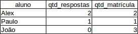

# Entendendo o LEFT JOIN
    
Os instrutores da instituição pediram um relatório com os alunos que são mais participativos na sala de aula, ou seja, queremos retornar os alunos que responderam mais exercícios. Consequentemente encontraremos também os alunos que não estão participando muito, então já aproveitamos e conversamos com eles para entender o que está acontecendo. Então começaremos retornando o aluno:

```
SELECT a.nome FROM aluno n;
```

Agora vamos contar a quantidade de respostas por meio da função `COUNT()` e agrupando pelo nome do aluno:

```
SELECT a.nome, COUNT(r.id) AS respostas
FROM aluno a
JOIN resposta r ON r.aluno_id = a.id
GROUP BY a.nome;

+-----------------+-----------+
| nome            | respostas |
+-----------------+-----------+
| Alberto Santos  |         9 |
| Frederico José  |         4 |
| João da Silva   |         7 |
| Renata Alonso   |         7 |
+-----------------+-----------+
```

Mas onde estão todos os meus alunos? Fugiram? Aparentemente essa *query* não está trazendo exatamente o que a gente esperava... Vamos contar a quantidade de alunos existentes:

```
SELECT COUNT(a.id) FROM aluno a;

+-------------+
| COUNT(a.id) |
+-------------+
|          16 |
+-------------+
```

Observe que existe 16 alunos no banco de dados, porém só foram retornados 4 alunos e suas respostas. Provavelmente não está sendo retornando os alunos que não possuem respostas! Vamos verificar o que está acontecendo exatamente. Vamos pegar um aluno que não foi retornado, como o de id 5. Quantas respostas ele tem?

```
SELECT r.id FROM resposta r WHERE r.aluno_id = 5;

+------------------+
| id               |
+------------------+
|                0 |
+------------------+
```

Tudo bem, ele não respondeu, mas como ele foi desaparecer daquela query nossa? Vamos pegar outro aluno que desapareceu, o de id 6:

```
SELECT r.id FROM resposta r WHERE r.aluno_id = 6;

+------------------+
| id               |
+------------------+
|                0 |
+------------------+
```

Opa, parece que encontramos um padrão.

```
SELECT r.id FROM resposta r WHERE r.aluno_id = 7;

+------------------+
| id               |
+------------------+
|                0 |
+------------------+
```

Sim, encontramos um padrão. Será que é verdadeiro essa teoria que está surgindo na minha cabeça? Alunos sem resposta desapareceram?
Vamos procurar todos os alunos que não possuem nenhuma resposta. Isto é selecionar os alunos que não existe, resposta deste aluno:

```
SELECT a.nome FROM aluno a WHERE NOT EXISTS (SELECT r.id FROM resposta r WHERE r.aluno_id = a.id);

+------------------+
| nome             |
+------------------+
| Paulo da Silva   |
| Carlos Cunha     |
| Paulo José       |
| Manoel Santos    |
| Renata Ferreira  |
| Paula Soares     |
| Jose da Silva    |
| Danilo Cunha     |
| Zilmira José     |
| Cristaldo Santos |
| Osmir Ferreira   |
| Claudio Soares   |
+------------------+
```

Se verificarmos os nomes, realmente, todos os alunos que não tem respostas não estão sendo retornados naquela primeira query. Porém nós queremos também que retorne os alunos sem respostas... Vamos tentar de uma outra maneira, vamos retornar o nome do aluno e a resposta que ele respondeu:

```
SELECT a.nome, r.resposta_dada FROM aluno a
JOIN resposta r ON r.aluno_id = a.id;

+-----------------+-----------------------------------------------------------------------------------+
| nome            | resposta_dada                                                                     |
+-----------------+-----------------------------------------------------------------------------------+
| João da Silva   | uma selecao                                                                       |
| João da Silva   | ixi, nao sei                                                                      |
| João da Silva   | alterar dados                                                                     |
| João da Silva   | eskecer o where e alterar tudo                                                    |
| João da Silva   | apagar coisas                                                                     |
| João da Silva   | tb nao pode eskecer o where                                                       |
| João da Silva   | inserir dados                                                                     |
| Frederico José  | buscar dados                                                                      |
| Frederico José  | select campos from tabela                                                         |
| Frederico José  | alterar coisas                                                                    |
| Frederico José  | ixi, nao sei                                                                      |
| Alberto Santos  | tempo pra fazer algo                                                              |
| Alberto Santos  | 1 a 4 semanas                                                                     |
| Alberto Santos  | melhoria do processo                                                              |
| Alberto Santos  | todo dia                                                                          |
| Alberto Santos  | reuniao de status                                                                 |
| Alberto Santos  | todo dia                                                                          |
| Alberto Santos  | o quadro branco                                                                   |
| Alberto Santos  | um metodo agil                                                                    |
| Alberto Santos  | tem varios outros                                                                 |
| Renata Alonso   | eh a internet                                                                     |
| Renata Alonso   | browser faz requisicao, servidor manda resposta                                   |
| Renata Alonso   | eh o servidor que lida com http                                                   |
| Renata Alonso   | nao sei                                                                           |
| Renata Alonso   | banco de dados!                                                                   |
| Renata Alonso   | eh colocar a app na internet                                                      |
| Renata Alonso   | depende da tecnologia, mas geralmente eh levar pra um servidor que ta na internet |
+-----------------+-----------------------------------------------------------------------------------+
```

Agora vamos adicionar a coluna `id` da tabela `aluno` e `aluno_id` da tabela `resposta`:

```
SELECT a.id, a.nome, r.aluno_id, r.resposta_dada FROM aluno a
JOIN resposta r ON r.aluno_id = a.id;

+----+-----------------+----------+-----------------------------------------------------------------------------------+
| id | nome            | aluno_id | resposta_dada                                                                     |
+----+-----------------+----------+-----------------------------------------------------------------------------------+
|  1 | João da Silva   |        1 | uma selecao                                                                       |
|  1 | João da Silva   |        1 | ixi, nao sei                                                                      |
|  1 | João da Silva   |        1 | alterar dados                                                                     |
|  1 | João da Silva   |        1 | eskecer o where e alterar tudo                                                    |
|  1 | João da Silva   |        1 | apagar coisas                                                                     |
|  1 | João da Silva   |        1 | tb nao pode eskecer o where                                                       |
|  1 | João da Silva   |        1 | inserir dados                                                                     |
|  2 | Frederico José  |        2 | buscar dados                                                                      |
|  2 | Frederico José  |        2 | select campos from tabela                                                         |
|  2 | Frederico José  |        2 | alterar coisas                                                                    |
|  2 | Frederico José  |        2 | ixi, nao sei                                                                      |
|  3 | Alberto Santos  |        3 | tempo pra fazer algo                                                              |
|  3 | Alberto Santos  |        3 | 1 a 4 semanas                                                                     |
|  3 | Alberto Santos  |        3 | melhoria do processo                                                              |
|  3 | Alberto Santos  |        3 | todo dia                                                                          |
|  3 | Alberto Santos  |        3 | reuniao de status                                                                 |
|  3 | Alberto Santos  |        3 | todo dia                                                                          |
|  3 | Alberto Santos  |        3 | o quadro branco                                                                   |
|  3 | Alberto Santos  |        3 | um metodo agil                                                                    |
|  3 | Alberto Santos  |        3 | tem varios outros                                                                 |
|  4 | Renata Alonso   |        4 | eh a internet                                                                     |
|  4 | Renata Alonso   |        4 | browser faz requisicao, servidor manda resposta                                   |
|  4 | Renata Alonso   |        4 | eh o servidor que lida com http                                                   |
|  4 | Renata Alonso   |        4 | nao sei                                                                           |
|  4 | Renata Alonso   |        4 | banco de dados!                                                                   |
|  4 | Renata Alonso   |        4 | eh colocar a app na internet                                                      |
|  4 | Renata Alonso   |        4 | depende da tecnologia, mas geralmente eh levar pra um servidor que ta na internet |
+----+-----------------+----------+-----------------------------------------------------------------------------------+
```

Perceba que separamos as informações dos alunos de um lado e a das respostas do outro lado. Analisando esses dados podemos verificar que quando fizemos o `JOIN` entre a tabela `aluno` e `resposta` estamos trazendo apenas todos os registros que possuem o `id` da tabela `aluno` e o `aluno_id` da tabela `resposta`.

O que o SQL faz também é que todos os alunos cujo o `id` não esteja na coluna `aluno_id` não serão retornados! Isto é, ele só trará para nós alguém que o `JOIN` tenha valor igual nas duas tabelas. Se só está presente em uma das tabelas, ele ignora.

Em SQL, existe um `JOIN` diferente que permite o retorno de alunos que também não possuam o `id` na tabela que está sendo associada. Queremos pegar todo mundo da tabela da esquerda, independentemente de existir ou não um valor na tabela da direita. É um tal de join de esquerda, o `LEFT JOIN`, ou seja, ele trará todos os registros da **tabela da esquerda** mesmo que não exista uma associação na tabela da direita:

```
SELECT a.id, a.nome, r.aluno_id, r.resposta_dada FROM aluno a
LEFT JOIN resposta r ON r.aluno_id = a.id;

+----+------------------+----------+-----------------------------------------------------------------------------------+
| id | nome             | aluno_id | resposta_dada                                                                     |
+----+------------------+----------+-----------------------------------------------------------------------------------+
|  1 | João da Silva    |        1 | uma selecao                                                                       |
|  1 | João da Silva    |        1 | ixi, nao sei                                                                      |
|  1 | João da Silva    |        1 | alterar dados                                                                     |
|  1 | João da Silva    |        1 | eskecer o where e alterar tudo                                                    |
|  1 | João da Silva    |        1 | apagar coisas                                                                     |
|  1 | João da Silva    |        1 | tb nao pode eskecer o where                                                       |
|  1 | João da Silva    |        1 | inserir dados                                                                     |
|  2 | Frederico José   |        2 | buscar dados                                                                      |
|  2 | Frederico José   |        2 | select campos from tabela                                                         |
|  2 | Frederico José   |        2 | alterar coisas                                                                    |
|  2 | Frederico José   |        2 | ixi, nao sei                                                                      |
|  3 | Alberto Santos   |        3 | tempo pra fazer algo                                                              |
|  3 | Alberto Santos   |        3 | 1 a 4 semanas                                                                     |
|  3 | Alberto Santos   |        3 | melhoria do processo                                                              |
|  3 | Alberto Santos   |        3 | todo dia                                                                          |
|  3 | Alberto Santos   |        3 | reuniao de status                                                                 |
|  3 | Alberto Santos   |        3 | todo dia                                                                          |
|  3 | Alberto Santos   |        3 | o quadro branco                                                                   |
|  3 | Alberto Santos   |        3 | um metodo agil                                                                    |
|  3 | Alberto Santos   |        3 | tem varios outros                                                                 |
|  4 | Renata Alonso    |        4 | eh a internet                                                                     |
|  4 | Renata Alonso    |        4 | browser faz requisicao, servidor manda resposta                                   |
|  4 | Renata Alonso    |        4 | eh o servidor que lida com http                                                   |
|  4 | Renata Alonso    |        4 | nao sei                                                                           |
|  4 | Renata Alonso    |        4 | banco de dados!                                                                   |
|  4 | Renata Alonso    |        4 | eh colocar a app na internet                                                      |
|  4 | Renata Alonso    |        4 | depende da tecnologia, mas geralmente eh levar pra um servidor que ta na internet |
|  5 | Paulo da Silva   |     NULL | NULL                                                                              |
|  6 | Carlos Cunha     |     NULL | NULL                                                                              |
|  7 | Paulo José       |     NULL | NULL                                                                              |
|  8 | Manoel Santos    |     NULL | NULL                                                                              |
|  9 | Renata Ferreira  |     NULL | NULL                                                                              |
| 10 | Paula Soares     |     NULL | NULL                                                                              |
| 11 | Jose da Silva    |     NULL | NULL                                                                              |
| 12 | Danilo Cunha     |     NULL | NULL                                                                              |
| 13 | Zilmira José     |     NULL | NULL                                                                              |
| 14 | Cristaldo Santos |     NULL | NULL                                                                              |
| 15 | Osmir Ferreira   |     NULL | NULL                                                                              |
| 16 | Claudio Soares   |     NULL | NULL                                                                              |
+----+------------------+----------+-----------------------------------------------------------------------------------+
```

Conseguimos retornar todos os registros. Então agora vamos tentar contar novamentes as respostas, agrupando pelo nome:

```
SELECT a.nome, COUNT(r.id) AS respostas
FROM aluno a
LEFT JOIN resposta r ON r.aluno_id = a.id
GROUP BY a.nome;

+------------------+-----------+
| nome             | respostas |
+------------------+-----------+
| Alberto Santos   |         9 |
| Carlos Cunha     |         0 |
| Claudio Soares   |         0 |
| Cristaldo Santos |         0 |
| Danilo Cunha     |         0 |
| Frederico José   |         4 |
| João da Silva    |         7 |
| Jose da Silva    |         0 |
| Manoel Santos    |         0 |
| Osmir Ferreira   |         0 |
| Paula Soares     |         0 |
| Paulo da Silva   |         0 |
| Paulo José       |         0 |
| Renata Alonso    |         7 |
| Renata Ferreira  |         0 |
| Zilmira José     |         0 |
+------------------+-----------+
```

Agora conseguimos retornar todos os alunos e a quantidade de respostas, mesmo que o aluno não tenha respondido pelo menos uma resposta. 

## RIGHT JOIN

Vamos supor que ao invés de retornar todos os alunos e suas respostas, mesmo que o aluno não tenha nenhuma resposta, queremos faer o contrário, ou seja, retornar todos as respostas que foram respondidas e as que não foram respondidas. Vamos verificar se existe alguma resposta que não foi respondida por um aluno:

```
SELECT r.id FROM resposta r
WHERE r.aluno_id IS NULL;

Empty set (0,00 sec)
```

Não existe exercício sem resposta, então vamos inserir uma resposta sem associar a um aluno:

```
INSERT INTO resposta (resposta_dada) VALUES ('x vale 15.');  

Query OK, 1 row affected (0,01 sec)
```

Se verificarmos novamente se existe uma resposta que não foi respondida por um aluno:

```
SELECT r.id FROM resposta r
WHERE r.aluno_id IS NULL;

+----+
| id |
+----+
| 28 |
+----+
```

Agora existe uma resposta que não foi associada a um aluno. Da mesma forma que utilizamos um `JOIN` diferente para pegar todos os dados da tabela da **esquerda (LEFT)** mesmo que não tenha associação com a tabela que está sendo juntada, existe também o `JOIN` que fará o procedimento, porém para a tabela da **direita (RIGHT)**, que é o tal do `RIGHT JOIN`:

```
SELECT a.nome, r.resposta_dada
FROM aluno a
RIGHT JOIN resposta r ON r.aluno_id = a.id;

+-----------------+-----------------------------------------------------------------------------------+
| nome            | resposta_dada                                                                     |
+-----------------+-----------------------------------------------------------------------------------+
| João da Silva   | uma selecao                                                                       |
| João da Silva   | ixi, nao sei                                                                      |
| João da Silva   | alterar dados                                                                     |
| João da Silva   | eskecer o where e alterar tudo                                                    |
| João da Silva   | apagar coisas                                                                     |
| João da Silva   | tb nao pode eskecer o where                                                       |
| João da Silva   | inserir dados                                                                     |
| Frederico José  | buscar dados                                                                      |
| Frederico José  | select campos from tabela                                                         |
| Frederico José  | alterar coisas                                                                    |
| Frederico José  | ixi, nao sei                                                                      |
| Alberto Santos  | tempo pra fazer algo                                                              |
| Alberto Santos  | 1 a 4 semanas                                                                     |
| Alberto Santos  | melhoria do processo                                                              |
| Alberto Santos  | todo dia                                                                          |
| Alberto Santos  | reuniao de status                                                                 |
| Alberto Santos  | todo dia                                                                          |
| Alberto Santos  | o quadro branco                                                                   |
| Alberto Santos  | um metodo agil                                                                    |
| Alberto Santos  | tem varios outros                                                                 |
| Renata Alonso   | eh a internet                                                                     |
| Renata Alonso   | browser faz requisicao, servidor manda resposta                                   |
| Renata Alonso   | eh o servidor que lida com http                                                   |
| Renata Alonso   | nao sei                                                                           |
| Renata Alonso   | banco de dados!                                                                   |
| Renata Alonso   | eh colocar a app na internet                                                      |
| Renata Alonso   | depende da tecnologia, mas geralmente eh levar pra um servidor que ta na internet |
| NULL            | x vale 15                                                                         |
+-----------------+-----------------------------------------------------------------------------------+
```

Observe que foi retornada a resposta em que não foi respondida por um aluno. 

Quando utilizamos apenas o `JOIN` significa que queremos retornar todos os registros que tenham uma associação, ou seja, que exista tanto na tabela da esquerda quanto na tabela da direita, esse `JOIN` também é conhecido como `INNER JOIN`. Vamos verificar o resultado utilizando o `INNER JOIN`:

```
SELECT a.nome, COUNT(r.id) AS respostas
FROM aluno a
INNER JOIN resposta r ON r.aluno_id = a.id
GROUP BY a.nome;

+-----------------+-----------+
| nome            | respostas |
+-----------------+-----------+
| Alberto Santos  |         9 |
| Frederico José  |         4 |
| João da Silva   |         7 |
| Renata Alonso   |         7 |
+-----------------+-----------+
```

Ele trouxe apenas os alunos que possuem ao menos uma resposta, ou seja, que exista a associação entre a tabela da esquerda (`aluno`) e a tabela da direita (`resposta`).

## JOIN ou SUBQUERY?

No capítulo anterior tivemos que fazer uma *query* para retornar todos os alunos e a quantidade de matrículas, porém utilizamos *subqueries* para resolver o nosso problema. Podemos também, construir essa *query* apenas com `JOIN`s. Vamos tentar:

```
SELECT a.nome, COUNT(m.id) AS qtd_matricula FROM aluno a
JOIN matricula m ON m.aluno_id = a.id
GROUP BY a.nome;

+-----------------+---------------+
| nome            | qtd_matricula |
+-----------------+---------------+
| Alberto Santos  |             2 |
| Frederico José  |             3 |
| João da Silva   |             2 |
| Manoel Santos   |             2 |
| Paula Soares    |             1 |
| Paulo José      |             1 |
| Renata Alonso   |             2 |
| Renata Ferreira |             1 |
+-----------------+---------------+
```

Aparentemente não retornou os alunos que não possuem matrícula, porém utilizamos apenas o `JOIN`, ou seja, o `INNER JOIN`. Ao invés do `INNER JOIN` que retorna apenas se existir a associação entre as tabelas da esquerda (`aluno`) e a da direita(`matricula`), nós queremos retornar todos os alunos, mesmo que não possuam matrículas, ou seja, tabela da esquerda. Então vamos tentar agora com o `LEFT JOIN`:

```
SELECT a.nome, COUNT(m.id) AS qtd_matricula FROM aluno a
LEFT JOIN matricula m ON m.aluno_id = a.id
GROUP BY a.nome;

+------------------+---------------+
| nome             | qtd_matricula |
+------------------+---------------+
| Alberto Santos   |             2 |
| Carlos Cunha     |             0 |
| Claudio Soares   |             0 |
| Cristaldo Santos |             0 |
| Danilo Cunha     |             0 |
| Frederico José   |             3 |
| João da Silva    |             2 |
| Jose da Silva    |             0 |
| Manoel Santos    |             2 |
| Osmir Ferreira   |             0 |
| Paula Soares     |             1 |
| Paulo da Silva   |             0 |
| Paulo José       |             1 |
| Renata Alonso    |             2 |
| Renata Ferreira  |             1 |
| Zilmira José     |             0 |
+------------------+---------------+
```

Da mesma forma que conseguimos pegar todos os alunos e a quantidade de respostas mesmo que o aluno não tenha respondido nenhuma resposta utilizando o `LEFT JOIN` poderíamos também resolver utilizando uma *subquery* parecida com qual retornava todos os alunos e a quantidade de matrículas:

```
SELECT a.nome, 
(SELECT COUNT(r.id) FROM resposta r WHERE r.aluno_id = a.id) AS respostas 
FROM aluno a;

+------------------+-----------+
| nome             | respostas |
+------------------+-----------+
| João da Silva    |         7 |
| Frederico José   |         4 |
| Alberto Santos   |         9 |
| Renata Alonso    |         7 |
| Paulo da Silva   |         0 |
| Carlos Cunha     |         0 |
| Paulo José       |         0 |
| Manoel Santos    |         0 |
| Renata Ferreira  |         0 |
| Paula Soares     |         0 |
| Jose da Silva    |         0 |
| Danilo Cunha     |         0 |
| Zilmira José     |         0 |
| Cristaldo Santos |         0 |
| Osmir Ferreira   |         0 |
| Claudio Soares   |         0 |
+------------------+-----------+
```

O resultado é o mesmo! Se o resultado é o mesmo, quando eu devo utilizar o `JOIN` ou as *subqueries*? Aparentemente a *subquery* é mais enxuta e mais fácil de ser escrita, porém os SGBDs sempre terão um desempenho melhor para `JOIN` em relação a *subqueries*, então prefira o uso de `JOIN`s ao invés de *subquery*.

Vamos tentar juntar as *queries* que fizemos agora pouco, porém em uma única *query*. Veja o exemplo em uma planilha.



Primeiro vamos fazer com *subqueries*. Então começaremos retornando o nome do aluno:

```
SELECT a.nome FROM aluno a;
```

Agora vamos contar todas as respostas e testar o resultado:

```
SELECT a.nome, 
(SELECT COUNT(r.id) FROM resposta r WHERE r.aluno_id = a.id) AS qtd_respostas
FROM aluno a;

+------------------+---------------+
| nome             | qtd_respostas |
+------------------+---------------+
| João da Silva    |             7 |
| Frederico José   |             4 |
| Alberto Santos   |             9 |
| Renata Alonso    |             7 |
| Paulo da Silva   |             0 |
| Carlos Cunha     |             0 |
| Paulo José       |             0 |
| Manoel Santos    |             0 |
| Renata Ferreira  |             0 |
| Paula Soares     |             0 |
| Jose da Silva    |             0 |
| Danilo Cunha     |             0 |
| Zilmira José     |             0 |
| Cristaldo Santos |             0 |
| Osmir Ferreira   |             0 |
| Claudio Soares   |             0 |
+------------------+---------------+
```

Por fim, vamos contar as matrículas e retornar a contagem:

```
SELECT a.nome, 
(SELECT COUNT(r.id) FROM resposta r WHERE r.aluno_id = a.id) AS qtd_respostas,
(SELECT COUNT(m.id) FROM matricula m WHERE m.aluno_id = a.id) AS qtd_matriculas
FROM aluno a;

+------------------+---------------+----------------+
| nome             | qtd_respostas | qtd_matriculas |
+------------------+---------------+----------------+
| João da Silva    |             7 |              2 |
| Frederico José   |             4 |              3 |
| Alberto Santos   |             9 |              2 |
| Renata Alonso    |             7 |              2 |
| Paulo da Silva   |             0 |              0 |
| Carlos Cunha     |             0 |              0 |
| Paulo José       |             0 |              1 |
| Manoel Santos    |             0 |              2 |
| Renata Ferreira  |             0 |              1 |
| Paula Soares     |             0 |              1 |
| Jose da Silva    |             0 |              0 |
| Danilo Cunha     |             0 |              0 |
| Zilmira José     |             0 |              0 |
| Cristaldo Santos |             0 |              0 |
| Osmir Ferreira   |             0 |              0 |
| Claudio Soares   |             0 |              0 |
+------------------+---------------+----------------+
```

Conseguimos o resultado esperado utilizando as *subqueries*, vamos tentar com o `LEFT JOIN`? Da mesma forma que fizemos anteriormente, começaremos retornando os alunos:

```
SELECT a.nome FROM aluno a;
```

Agora vamos juntar as tabela `aluno` com as tabelas `resposta` e `matricula`:

```
SELECT a.nome, r.id AS qtd_respostas, 
m.id AS qtd_matriculas 
FROM aluno a
LEFT JOIN resposta r ON r.aluno_id = a.id
LEFT JOIN matricula m ON m.aluno_id = a.id;

+------------------+---------------+----------------+
| nome             | qtd_respostas | qtd_matriculas |
+------------------+---------------+----------------+
| João da Silva    |             1 |              1 |
| João da Silva    |             2 |              1 |
| João da Silva    |             3 |              1 |
| João da Silva    |             4 |              1 |
| João da Silva    |             5 |              1 |
| João da Silva    |             6 |              1 |
| João da Silva    |             7 |              1 |
| Frederico José   |             8 |              2 |
| Frederico José   |             9 |              2 |
| Frederico José   |            10 |              2 |
| Frederico José   |            11 |              2 |
| Alberto Santos   |            12 |              3 |
| Alberto Santos   |            13 |              3 |
| Alberto Santos   |            14 |              3 |
| Alberto Santos   |            15 |              3 |
| Alberto Santos   |            16 |              3 |
| Alberto Santos   |            17 |              3 |
| Alberto Santos   |            18 |              3 |
| Alberto Santos   |            19 |              3 |
| Alberto Santos   |            20 |              3 |
| Renata Alonso    |            21 |              4 |
| Renata Alonso    |            22 |              4 |
| Renata Alonso    |            23 |              4 |
| Renata Alonso    |            24 |              4 |
| Renata Alonso    |            25 |              4 |
| Renata Alonso    |            26 |              4 |
| Renata Alonso    |            27 |              4 |
| Renata Alonso    |            21 |              9 |
| Renata Alonso    |            22 |              9 |
| Renata Alonso    |            23 |              9 |
| Renata Alonso    |            24 |              9 |
| Renata Alonso    |            25 |              9 |
| Renata Alonso    |            26 |              9 |
| Renata Alonso    |            27 |              9 |
| João da Silva    |             1 |             11 |
| João da Silva    |             2 |             11 |
| João da Silva    |             3 |             11 |
| João da Silva    |             4 |             11 |
| João da Silva    |             5 |             11 |
| João da Silva    |             6 |             11 |
| João da Silva    |             7 |             11 |
| Frederico José   |             8 |             12 |
| Frederico José   |             9 |             12 |
| Frederico José   |            10 |             12 |
| Frederico José   |            11 |             12 |
| Alberto Santos   |            12 |             13 |
| Alberto Santos   |            13 |             13 |
| Alberto Santos   |            14 |             13 |
| Alberto Santos   |            15 |             13 |
| Alberto Santos   |            16 |             13 |
| Alberto Santos   |            17 |             13 |
| Alberto Santos   |            18 |             13 |
| Alberto Santos   |            19 |             13 |
| Alberto Santos   |            20 |             13 |
| Frederico José   |             8 |             14 |
| Frederico José   |             9 |             14 |
| Frederico José   |            10 |             14 |
| Frederico José   |            11 |             14 |
| Paulo José       |          NULL |              5 |
| Manoel Santos    |          NULL |              6 |
| Renata Ferreira  |          NULL |              7 |
| Paula Soares     |          NULL |              8 |
| Manoel Santos    |          NULL |             10 |
| Paulo da Silva   |          NULL |           NULL |
| Carlos Cunha     |          NULL |           NULL |
| Jose da Silva    |          NULL |           NULL |
| Danilo Cunha     |          NULL |           NULL |
| Zilmira José     |          NULL |           NULL |
| Cristaldo Santos |          NULL |           NULL |
| Osmir Ferreira   |          NULL |           NULL |
| Claudio Soares   |          NULL |           NULL |
+------------------+---------------+----------------+
```

Antes de contarmos as colunas de qtd_resposas e qtd_matricula, vamos analisar um pouco esse resultado. Note que o aluno João da Silva retornou 14 vezes, parece que tem alguma coisa estranha. Vamos pegar o `id` do João da Silva e vamos verificar os registros dele na tabela `resposta` e na tabela `matricula`:

```
SELECT a.id FROM aluno a WHERE a.nome = 'João da Silva';

+----+
| id |
+----+
|  1 |
+----+
```

Agora vamos verificar todos os registros dele na tabela `resposta`:

```
SELECT r.id FROM resposta r
WHERE r.aluno_id = 1;

+----+
| id |
+----+
|  1 |
|  2 |
|  3 |
|  4 |
|  5 |
|  6 |
|  7 |
+----+
```

Foram retornados 7 registros, agora vamos verificar na tabela `matricula`:

``` 
SELECT m.id FROM matricula m
WHERE m.aluno_id = 1;

+----+
| id |
+----+
|  1 |
| 11 |
+----+
```

Foram retornados 2 registros. Se analisarmos um pouco esses três resultados chegamos aos seguintes números: 

aluno = 1
respostas = 7
matrículas = 2

Vamos executar novamente a nossa *query* que retorna o aluno e a contagem de respostas e matrículas:

```
SELECT a.nome, r.id AS qtd_respostas, 
m.id AS qtd_matriculas 
FROM aluno a
LEFT JOIN resposta r ON r.aluno_id = a.id
LEFT JOIN matricula m ON m.aluno_id = a.id;

+------------------+---------------+----------------+
| nome             | qtd_respostas | qtd_matriculas |
+------------------+---------------+----------------+
| João da Silva    |             1 |              1 |
| João da Silva    |             2 |              1 |
| João da Silva    |             3 |              1 |
| João da Silva    |             4 |              1 |
| João da Silva    |             5 |              1 |
| João da Silva    |             6 |              1 |
| João da Silva    |             7 |              1 |
| Frederico José   |             8 |              2 |
| Frederico José   |             9 |              2 |
| Frederico José   |            10 |              2 |
| Frederico José   |            11 |              2 |
| Alberto Santos   |            12 |              3 |
| Alberto Santos   |            13 |              3 |
| Alberto Santos   |            14 |              3 |
| Alberto Santos   |            15 |              3 |
| Alberto Santos   |            16 |              3 |
| Alberto Santos   |            17 |              3 |
| Alberto Santos   |            18 |              3 |
| Alberto Santos   |            19 |              3 |
| Alberto Santos   |            20 |              3 |
| Renata Alonso    |            21 |              4 |
| Renata Alonso    |            22 |              4 |
| Renata Alonso    |            23 |              4 |
| Renata Alonso    |            24 |              4 |
| Renata Alonso    |            25 |              4 |
| Renata Alonso    |            26 |              4 |
| Renata Alonso    |            27 |              4 |
| Renata Alonso    |            21 |              9 |
| Renata Alonso    |            22 |              9 |
| Renata Alonso    |            23 |              9 |
| Renata Alonso    |            24 |              9 |
| Renata Alonso    |            25 |              9 |
| Renata Alonso    |            26 |              9 |
| Renata Alonso    |            27 |              9 |
| João da Silva    |             1 |             11 |
| João da Silva    |             2 |             11 |
| João da Silva    |             3 |             11 |
| João da Silva    |             4 |             11 |
| João da Silva    |             5 |             11 |
| João da Silva    |             6 |             11 |
| João da Silva    |             7 |             11 |
| Frederico José   |             8 |             12 |
| Frederico José   |             9 |             12 |
| Frederico José   |            10 |             12 |
| Frederico José   |            11 |             12 |
| Alberto Santos   |            12 |             13 |
| Alberto Santos   |            13 |             13 |
| Alberto Santos   |            14 |             13 |
| Alberto Santos   |            15 |             13 |
| Alberto Santos   |            16 |             13 |
| Alberto Santos   |            17 |             13 |
| Alberto Santos   |            18 |             13 |
| Alberto Santos   |            19 |             13 |
| Alberto Santos   |            20 |             13 |
| Frederico José   |             8 |             14 |
| Frederico José   |             9 |             14 |
| Frederico José   |            10 |             14 |
| Frederico José   |            11 |             14 |
| Paulo José       |          NULL |              5 |
| Manoel Santos    |          NULL |              6 |
| Renata Ferreira  |          NULL |              7 |
| Paula Soares     |          NULL |              8 |
| Manoel Santos    |          NULL |             10 |
| Paulo da Silva   |          NULL |           NULL |
| Carlos Cunha     |          NULL |           NULL |
| Jose da Silva    |          NULL |           NULL |
| Danilo Cunha     |          NULL |           NULL |
| Zilmira José     |          NULL |           NULL |
| Cristaldo Santos |          NULL |           NULL |
| Osmir Ferreira   |          NULL |           NULL |
| Claudio Soares   |          NULL |           NULL |
+------------------+---------------+----------------+
```

Repare que a nossa *query* associando um aluno 1, com a resposta 1 e matrícula 1, o mesmo aluno 1, com resposta 1 e matrícula 11 e assim sucessivamente... Isso significa que essa query está multiplicando o aluno(1) x respostas(7) x matrículas(2)... Com certeza essa contagem não funcionará! Precisamos de resultados distintos, ou seja, iremos utilizar o `DISTINCT` para evitar esse problema. Agora podemos contar as respostas e as matrículas:

```
SELECT a.nome, COUNT(DISTINCT r.id) AS qtd_respostas, 
COUNT(DISTINCT m.id) AS qtd_matriculas 
FROM aluno a
LEFT JOIN resposta r ON r.aluno_id = a.id
LEFT JOIN matricula m ON m.aluno_id = a.id
GROUP BY a.nome;

+------------------+---------------+----------------+
| nome             | qtd_respostas | qtd_matriculas |
+------------------+---------------+----------------+
| Alberto Santos   |             9 |              2 |
| Carlos Cunha     |             0 |              0 |
| Claudio Soares   |             0 |              0 |
| Cristaldo Santos |             0 |              0 |
| Danilo Cunha     |             0 |              0 |
| Frederico José   |             4 |              3 |
| João da Silva    |             7 |              2 |
| Jose da Silva    |             0 |              0 |
| Manoel Santos    |             0 |              2 |
| Osmir Ferreira   |             0 |              0 |
| Paula Soares     |             0 |              1 |
| Paulo da Silva   |             0 |              0 |
| Paulo José       |             0 |              1 |
| Renata Alonso    |             7 |              2 |
| Renata Ferreira  |             0 |              1 |
| Zilmira José     |             0 |              0 |
+------------------+---------------+----------------+
```

E se não adicionássemos a instrução `DISTINCT`? O que aconteceria? Vamos testar:

```
SELECT a.nome, COUNT(r.id) AS qtd_respostas, 
COUNT(m.id) AS qtd_matriculas 
FROM aluno a
LEFT JOIN resposta r ON r.aluno_id = a.id
LEFT JOIN matricula m ON m.aluno_id = a.id
GROUP BY a.nome;

+------------------+---------------+----------------+
| nome             | qtd_respostas | qtd_matriculas |
+------------------+---------------+----------------+
| Alberto Santos   |            18 |             18 |
| Carlos Cunha     |             0 |              0 |
| Claudio Soares   |             0 |              0 |
| Cristaldo Santos |             0 |              0 |
| Danilo Cunha     |             0 |              0 |
| Frederico José   |            12 |             12 |
| João da Silva    |            14 |             14 |
| Jose da Silva    |             0 |              0 |
| Manoel Santos    |             0 |              2 |
| Osmir Ferreira   |             0 |              0 |
| Paula Soares     |             0 |              1 |
| Paulo da Silva   |             0 |              0 |
| Paulo José       |             0 |              1 |
| Renata Alonso    |            14 |             14 |
| Renata Ferreira  |             0 |              1 |
| Zilmira José     |             0 |              0 |
+------------------+---------------+----------------+
```

O resultado além de ser bem maior que o esperado, repete nas duas colunas , pois está acontecendo aquele problema da multiplicação das linhas! Perceba que só conseguimos verificar de uma forma rápida o problema que aconteceu, pois fizemos a *query* **passo-a-passo**, verificando cada resultado e, ao mesmo tempo, corringo os problemas que surgiam. 

## Resumindo

Neste capítulo aprendemos como utilizar os diferentes tipos de `JOIN`s, como por exemplo o `LEFT JOIN` que retorna os registros da tabela a esquerda e o `RIGHT JOIN` que retorna os da direita mesmo que não tenham associações. Vimos também que o `JOIN` também é conhecido como `INNER JOIN` que retorna apenas os registros que estão associados. Além disso, vimos que algumas *queries* podem ser resolvidas utilizando *subqueries* ou `LEFT/RIGHT JOIN`, porém é importante lembrar que os SGBDs sempre terão melhor desempenho com o os `JOIN`s, por isso é recomendado que utilize os `JOIN`s. Vamos para os exercícios?

# Exercícios

1. Exiba todos os alunos e suas possíveis respostas. Exiba todos os alunos, mesmo que eles não tenham respondido nenhuma pergunta.

2. Exiba agora todos os alunos e suas possíveis respostas para o exercício com ID = 1. Exiba todos os alunos mesmo que ele não tenha respondido o exercício.

Lembre-se de usar a condição no JOIN.

3. Qual a diferença entre o JOIN convencional (muitas vezes chamado também de INNER JOIN) para o LEFT JOIN?
